__LAB 1\. Designing a Modern Real\-World Web Application__

1. __Tổng quan về Chiến lược và Quy trình Phát triển Ứng dụng__

Các phương pháp luận phổ biến bao gồm:

- Waterfall model
- Rapid application development
- __Agile software development__
- prototype model

Trên thực tế, một số tổ chức sử dụng các phương pháp và quy trình phát triển kết hợp được thiết kế riêng của họ\. Bất kể chúng ta áp dụng phương pháp phần mềm nào, chúng ta phải tuân thủ một số giai đoạn chung:

__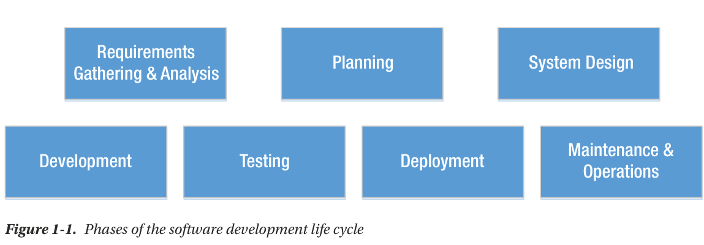__

- __Requirements Gathering and Analysis__
	- __Xác định tất cả các yêu cầu chức năng của phần mềm và tạo một tài liệu đặc tả chức năng ngắn gọn và sau đó chia sẻ nó với tất cả các bên liên quan\.__
- __Planning __
	- __Góm nhóm các chức năng, đế xuất kết hoạch thực hiện dự án với các mốc thời gian và phân phối hợp lý__
- __System Design __
	- __Thiết kế toàn bộ kiến trúc của hệ thống\. Và liệt kê tất cả *các công nghệ \(technologies\), công cụ \(tools\) và sản phẩm thương mại sẵn có* sẽ được sử dụng trong quá trình phát triển ứng dụng\. Kế quả là các thông số kỹ thuật cho *logical and physical architecture*\.__
- __Development__
	- __Giai đoạn code và phát triển ứng dụng \. Giai đoạn này có thể tuân theo các chiến lược như phát triển theo *test\-driven development \(TDD\) hoặc domain\-driven \(DDD\)\. *__
	- __*Trong TDD, tạo các unit tests trước khi phát triển mã ứng dụng\. Lúc đầu, tất cả các unit tests sẽ fails, và sau đó phải cấu trúc lại mã ứng dụng để vượt qua các unit tests\. Đây là một quá trình lặp đi lặp lại xảy ra mỗi khi một chức năng mới được thêm vào hoặc một chức năng hiện có được sửa đổi\.*__
- __Testing__
	- __*Thực hiện test ứng dụng\. Quá trình bao gồm system integration testing \(SIT\), sau đó user acceptance testing  \(UAT\)\. Thử nghiệm phải là một hoạt động lặp đi lặp lại và liên tục để làm cho ứng dụng ổn định hơn\.*__
- __Deployment__
	- __*Hoạt động triển khai tất cả các thủ tục cần thiết để lưu trữ ứng dụng trên môi trường\. Hệ thống kiểm soát phiên bản hiện tại hỗ trợ triển khai tự động đến các môi trường đã cấu hình\.*__
- __Maintenance and Operations__
	- __*Bảo trì là giai đoạn chúng tôi giám sát chặt chẽ ứng dụng được lưu trữ để tìm các vấn đề và sau đó phát hành các bản vá lỗi để khắc phục\. Các tác vụ vận hành như nâng cấp phần mềm trên máy chủ và sao lưu cơ sở dữ liệu được thực hiện như một phần của hoạt động bảo trì\. *__

1. __Giới thiệu về “Ứng dụng Trung tâm dịch vụ ô tô”__

Trung tâm Dịch vụ Ô tô là một công cung cấp tất cả các loại dịch vụ bảo dưỡng ô tô cho khách hàng của mình\. Công ty này có hơn 20 chi nhánh và phục vụ hơn 3\.000 khách hàng mỗi ngày\. Nó cung cấp trải nghiệm cho khách hàng trong tất cả các lĩnh vực liên quan đến sửa chữa và bảo dưỡng ô tô\. Trung tâm Dịch vụ Ô tô cung cấp các dịch vụ bảo dưỡng ô tô trong các lĩnh vực sau: Động cơ và Lốp xe, Điều hòa không khí, Hộp số Tự động và Thủ công, Hệ thống Điện, Ắc quy, Phanh và Thay nhớt\. Trung tâm Dịch vụ này cũng sẽ giải quyết các yêu cầu và khiếu nại cụ thể của khách hàng về xe ô tô\. Đôi khi nó cung cấp các dịch vụ bổ sung bao gồm kéo, đón và thả, bảo hiểm và các dịch vụ liên quan đến tài chính\. Trung tâm Dịch vụ này sử dụng hơn 1\.500 chuyên gia với nhiều năng lực khác nhau\. Hầu hết nhân viên là kỹ sư dịch vụ chịu trách nhiệm về các hoạt động dịch vụ hàng ngày, trong khi các nhân viên khác đảm nhận các trách nhiệm như đặt hàng phụ tùng, quản lý hậu cần và điều hành các hoạt động tài chính\. Ngày nay, Trung tâm Dịch vụ Ô tô đang đối mặt với một thách thức kinh doanh lớn: duy trì giao tiếp tốt với khách hàng\. Công ty thiếu một phương pháp giao tiếp thời gian thực với khách hàng có giá cả phải chăng và đáng tin cậy \(ví dụ: trò chuyện trực tiếp giữa khách hàng và kỹ sư dịch vụ hoặc e\-mail\.

Phần lớn khách hàng muốn cập nhật dịch vụ theo thời gian thực và đặt lịch hẹn dịch vụ tự động\. Hiện tại, công ty yêu cầu khách hàng đến chi nhánh Trung tâm dịch vụ và thảo luận về các dịch vụ với một kỹ sư dịch vụ có sẵn, người này sẽ mở thẻ công việc dịch vụ ghi lại các chi tiết\. Trong quá trình dịch vụ, tất cả các cuộc giao tiếp giữa kỹ sư dịch vụ và khách hàng đều diễn ra thông qua các cuộc gọi điện thoại và các điểm đã thảo luận sẽ được đính kèm lại vào thẻ công việc\. Sau khi dịch vụ hoàn tất, khách hàng thanh toán số tiền trên hóa đơn và kỹ sư dịch vụ sẽ đóng thẻ công việc\. Trung tâm dịch vụ ô tô đã xác định rằng toàn bộ quy trình này không hiệu quả và đang làm giảm giá trị thương hiệu của mình vì những lý do sau:

- Gây ra sự chậm trễ trong dịch vụ vì phụ thuộc nhiều vào yếu tố con người
- Thiếu minh bạch
- Tạo cơ hội cho việc giao tiếp sai lệch
- Không cung cấp độ chính xác 
- Không cho phép công ty tiếp cận khách hàng và quảng bá các ưu đãi, giảm giá và gói dịch vụ\.

1. __Xác định các chức năng của ứng dụng__

__Module__

__Functionality__

__User Administration__

__Khi khởi động ứng dụng, người dùng Quản trị viên phải được cấp phép\. Admin là người dùng có quyền truy cập vào toàn bộ ứng dụng và có thể quản lý những người dùng khác; ví dụ: cung cấp kỹ sư dịch vụ\. *Người dùng Admin có thể quản lý tất cả thông tin khách hàng và dữ liệu chính của ứng dụng\.*__

__Ứng dụng phải có khả năng *cho phép khách hàng đăng nhập bằng cách sử dụng thông tin đăng nhập trên mạng xã hội của họ *\(ví dụ: Gmail\)\. __

__Các hoạt động quản lý người dùng bao gồm đăng ký khách hàng, nhắc nhở người dùng hoặc thay đổi mật khẩu, hủy kích hoạt người dùng \(người dùng Quản trị viên có thể thực hiện hành động này\), đăng xuất, chỉ định vai trò cho kỹ sư dịch vụ và khách hàng khi đăng ký\. Người dùng quản trị sẽ có thể cung cấp các nhân viên khác vào hệ thống\.__

__Service Requests Management__

__Khách hàng sẽ có thể tạo một yêu cầu dịch vụ mới\. Người dùng quản trị nên liên kết dịch vụ với một kỹ sư dịch vụ\. Bất cứ khi nào trạng thái của yêu cầu dịch vụ thay đổi, khách hàng phải được thông báo qua e\-mail / văn bản\.__

__Dựa trên tiến trình dịch vụ, người dùng Quản trị viên và kỹ sư dịch vụ có thể sửa đổi chi tiết thẻ công việc\.__

__Khách hàng, kỹ sư dịch vụ và người dùng Quản trị viên phải có các trang tổng quan tương ứng hiển thị tóm tắt về tất cả các hoạt động và các bản cập nhật mới nhất\.__

__Service Notifications__

__Khách hàng sẽ có thể tạo một yêu cầu dịch vụ mới\. Người dùng quản trị nên liên kết dịch vụ với một kỹ sư dịch vụ\. Bất cứ khi nào trạng thái của yêu cầu dịch vụ thay đổi, khách hàng phải được thông báo qua e\-mail / văn bản\.__

__Dựa trên tiến trình dịch vụ, người dùng Quản trị viên và kỹ sư dịch vụ có thể sửa đổi chi tiết thẻ công việc\.__

__Khách hàng, kỹ sư dịch vụ và người dùng Quản trị viên phải có các trang tổng quan tương ứng hiển thị tóm tắt về tất cả các hoạt động và các bản cập nhật mới nhất\.__

__Promotions__

__Người dùng Quản trị viên sẽ có thể thêm thông tin chi tiết về các chương trình khuyến mãi và ưu đãi mới\. __

__Khách hàng sẽ nhận được thông báo theo thời gian thực với các chi tiết này\. Khách hàng sẽ có thể xem tất cả các chương trình khuyến mãi và ưu đãi\.__

1. __Technologies Used in Building the Application__

__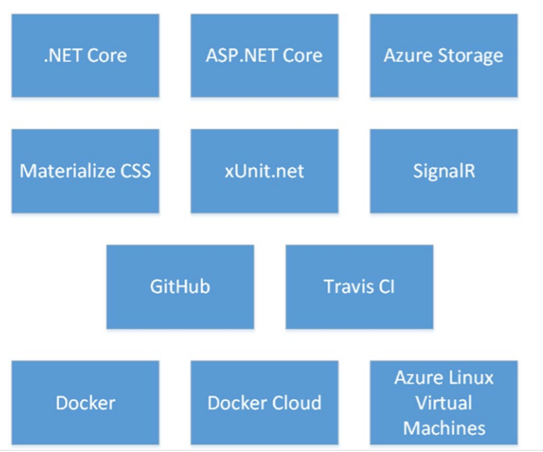__

1. __Logical Architecture of the Application__

Kiến trúc logic là một bản thiết kế mô tả tất cả các thành phần của hệ thống và tương tác của chúng\. 

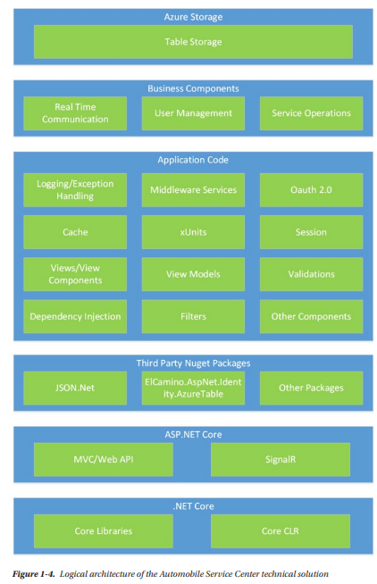

1. __Continuous Integration and Deployment Architecture__

Trong thế giới phát triển phần mềm ngày nay,__* tốc độ và tính linh hoạt là yếu tố quyết định đối với thành công của một dự án*__\. Để đáp ứng nhanh chóng với yêu cầu thị trường đang thay đổi liên tục, các nhóm phát triển phần mềm cần tìm kiếm các phương pháp và công nghệ hiện đại để tối ưu hóa quy trình phát triển\.

Kiến trúc phát triển và tích hợp liên tục\(CI/CD\)  là các phương pháp DevOps\. Phương pháp này sẽ ngăn chặn nỗ lực thủ công và các tác vụ lặp đi lặp lại trên mọi bản dựng, do đó giảm khả năng xảy ra lỗi của con người, cải thiện chất lượng bản dựng và tăng hiệu quả của toàn bộ vòng đời phát triển, thử nghiệm và triển khai\.

Quy trình bắt đầu với developer, người thiết kế và phát triển ứng dụng trên máy cục bộ bằng cách kết nối với trình giả lập Azure Storage trên máy cục bộ\. Khi hoàn thành thành công một tính năng, nhà phát triển sẽ commit code vào branch Dev của kho lưu trữ mã nguồn GitHub\. Khi cam kết thành công, dịch vụ Travis CI sẽ kích hoạt bản build để xác thực toàn bộ mã nguồn xem có lỗi không và chạy các trường hợp thử nghiệm xUnit\. Nếu bản dựng không thành công, developer và tất cả các bên liên quan khác sẽ được thông báo qua e\-mail và developer có trách nhiệm sửa lỗi và commit code trở lại branch Dev\. Đây là một quá trình lặp đi lặp lại đối với tất cả các developer trong giai đoạn phát triển\.

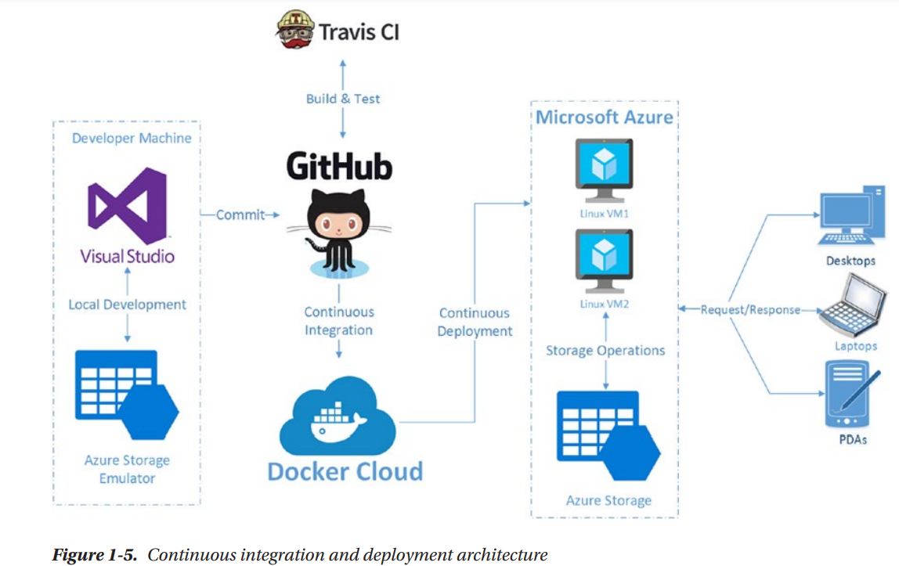

Khi quyết định triển khai các tính năng đã hoàn thành lên production servers cho người dùng, nhánh Dev sẽ được hợp nhất với nhánh master\. Dịch vụ Travis CI sẽ build lại trên nhánh master và xác thực bản dựng\. Quá trình lặp lại tương tự cũng tiếp tục trên nhánh master\.

Triển khai đến production servers được kích hoạt từ master branch\. Sử dụng công nghệ Docker để tạo các container và triển khai chúng đến Azure Linux Virtual Machines\. Bất cứ khi nào merge hoặc commit xảy ra tại master branch trên GitHub, Docker Cloud sẽ lấy mã nguồn mới nhất, và build  một Docker image, tạo một container Docker và cuối cùng đẩy container đến các Azure Virtual Machine được liên kết\.

Phân biệt CI/CD & Agile & DevOps: [link](https://cloud.z.com/vn/news/ci-cd/#:~:text=CI%2FCD%20l%C3%A0%20vi%E1%BA%BFt%20t%E1%BA%AFt,m%C3%A3%20ngu%E1%BB%93n%20c%E1%BB%A7a%20%E1%BB%A9ng%20d%E1%BB%A5ng.)

1. __Software Prerequisites__

- Download và cài đặt Visual Studio 2022:
	-  ASP\.NET Web Development, Azure Development, và \.NET Core Cross\-Platform Development \(\.Net 8\)
- Tạo các tài khoản
	- GitHub \(https://github\.com/\) 
	- Travis CI \(https://travis\-ci\.org/\):Associate Travis CI with GitHub by signing in with GitHub credentials\.	
	- Docker \(www\.docker\.com\)
	- Microsoft Azure Subscription \(https://azure\.microsoft\.com/\): Create a free Azure Account\.

1. __Tạo ứng dụng Automobile Service Center Application__

- Create a new project:   

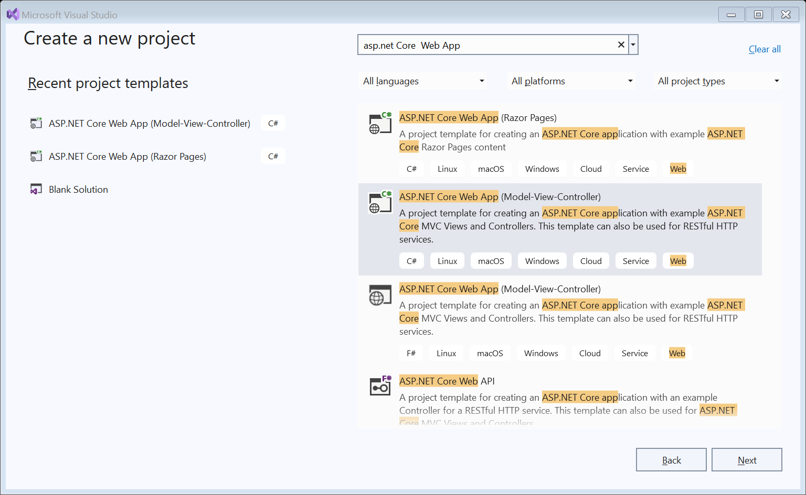

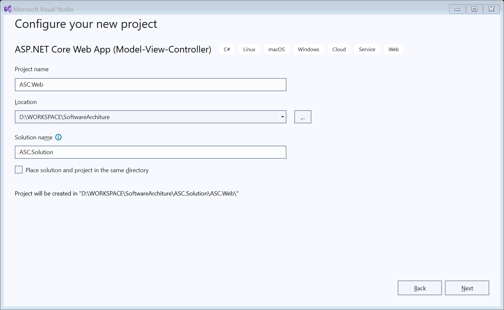

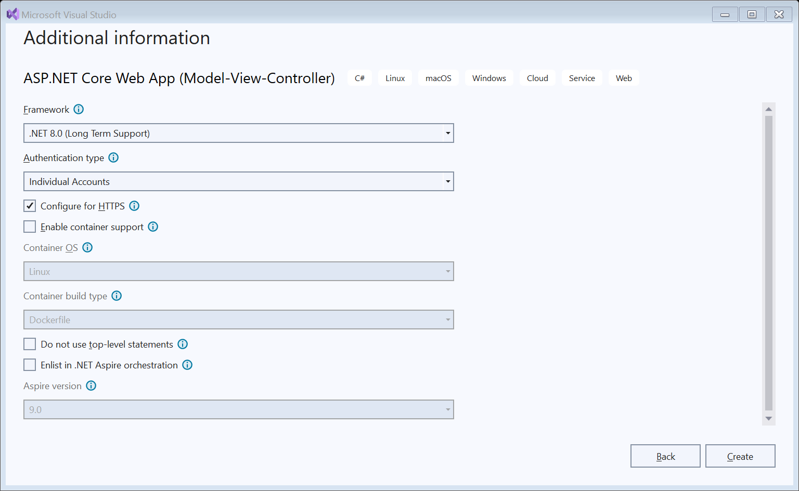

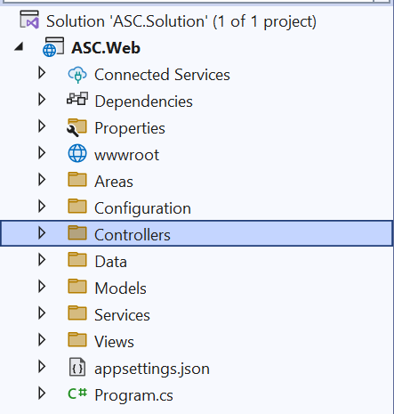

1. __Thiết lập cấu hình ứng dụng__

Bổ sung cấu hình tiêu đề cho ứng dụng trong file __appsettings\.json__

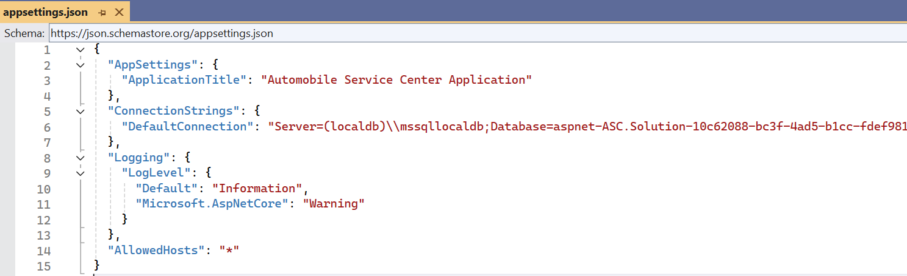

Tạo class ApplicationSettings\.cs để lấy cấu hình ứng dụng theo đường dẫn sau nằm trong project\.

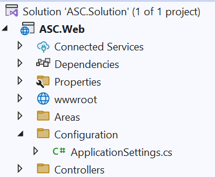

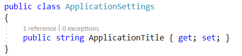

Tạo một đối tượng thuộc lớp ApplicationSettings lưu trữ thông tin cấu hình thực tế từ, và được tiêm phụ thuộc \(__Dependency Injection__\) vào __view__ hoặc __controler__ sử dụng __IOption\. __Cập nhật file __Program\.cs__

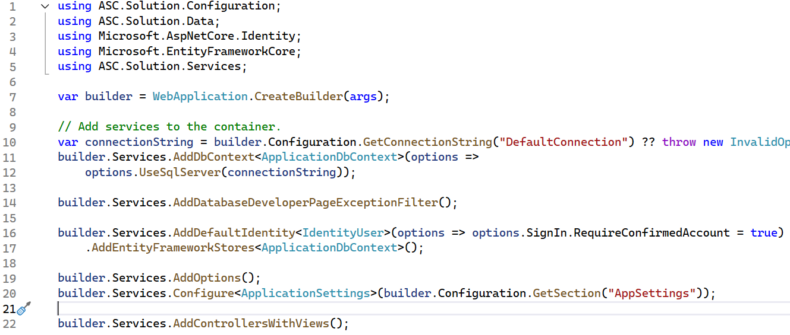

Chỉnh sửa __\_Layout\.cshtml__ để hiển thị tên ứng dụng trong phần navigation\.

__Inject IOptions into a View, Updated Nav Bar__

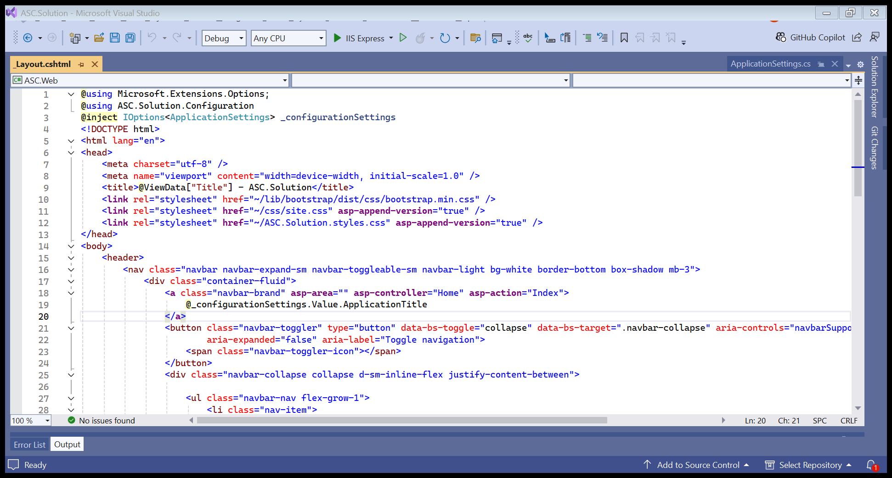

Để sử dụng setting trong controllers, thực hiện inject  IOptions<ApplicationSettings> vào controller\.

__Dependency Injection in Controllers__

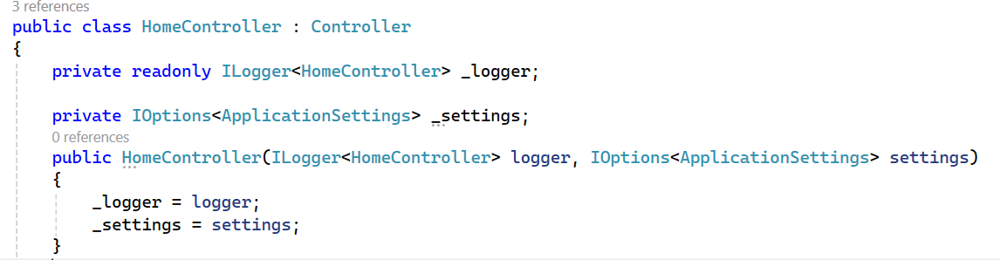

__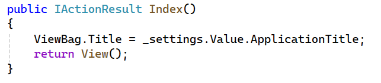__

__Tạo các tệp cấu hình khác nhau cho các môi trường khác nhau\. Tạo tệp JSON appsettings__

__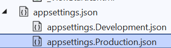__

v

__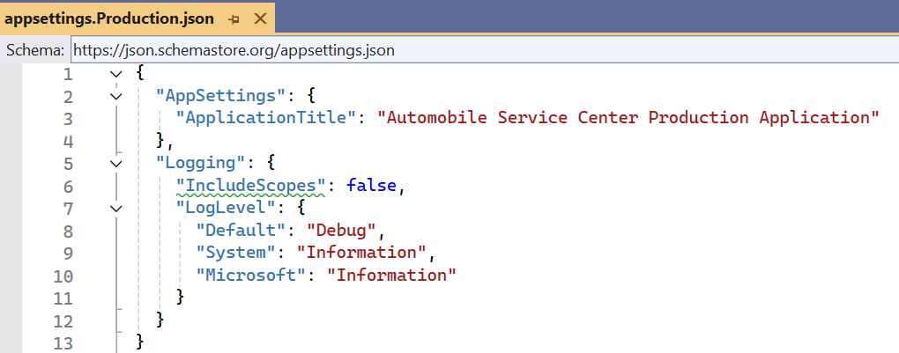__

__	__Thiết lập biến môi trường, right\-click dự án  và chọn Properties\. Vào tab  Debug tab, click 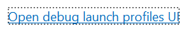 \. Và thiết lập environment variables với “__ASPNETCORE\_ENVIRONMENT=Production__”\.	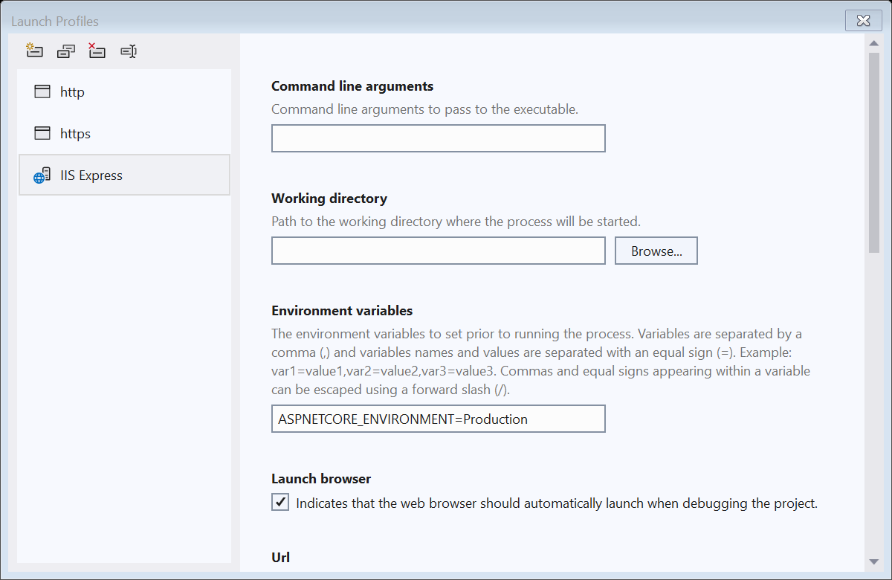

v

v

1. __Using Dependency Injection in the ASP\.NET Core Application__

__Dependency injection \(DI\) __is a __software pattern__ through which a software application __*can achieve loosely  coupled layers*__\. *Instead of directly creating objects at different layers of the application,* dependency  injection will *inject the dependent objects in different ways* \(for example, __*constructor injection* or *method  injection*__\)\. This pattern uses __*abstractions \(usually interfaces\)*__ and containers \(it’s essentially a __*factory that is  responsible for providing instances of types*__\) to __*resolve dependencies at runtime*\.__

ASP\.NET Core provides extensions to configure services such as Identity, Entity Framework, Authentication, and Caching\. We can configure our custom business services by using any of the following extensions:__ __

• Transient: A new instance of the object will be created every time a call is made for that type\. 

• Scoped: Only one instance of the object will be created, and it will be served for every call made for the type in the same request\. 

• Singleton: Only one instance of the object will be created, and it will be served for every call made for the type for all requests\.

Tạo các class dịch vụ sau:

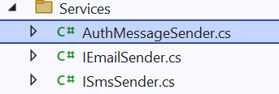

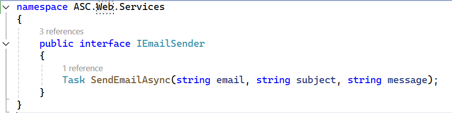

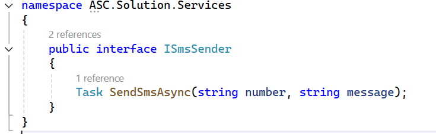

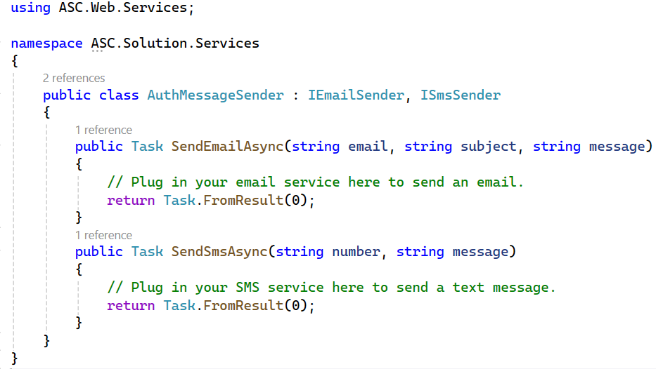

__Dependency Injection Container Configuration in Program\.cs__

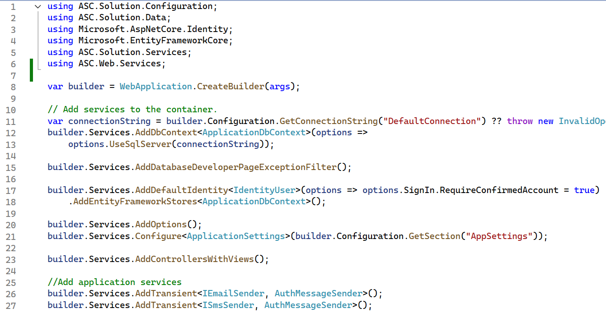

v

__Configured services can be accessed throughout the application in many ways__

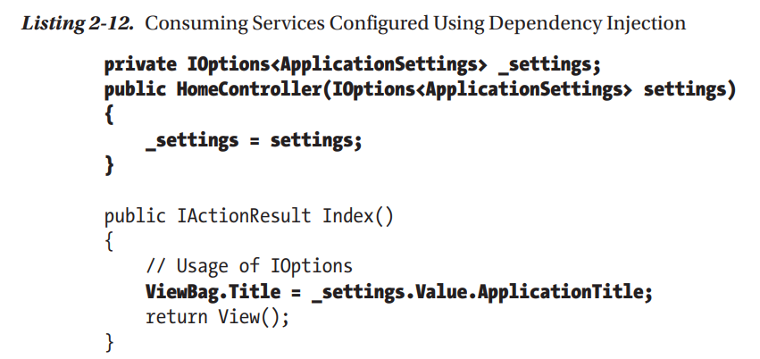

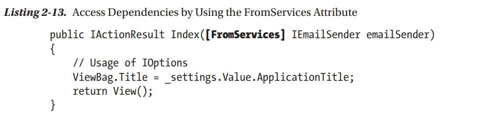

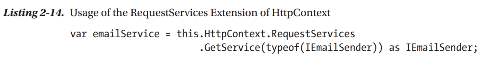

__Bước 3\. Sử dụng Materialize CSS thiết kế giao diện cho ứng dụng__

__Thiết kế dao diện có dạng sau__

__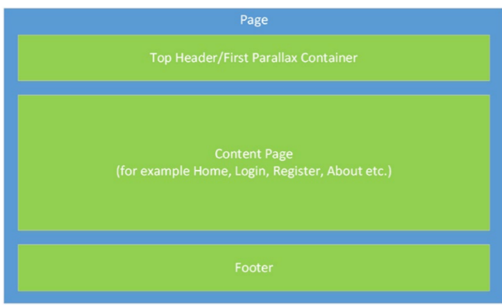__

Download tempate Parallax theme từ link [https://materializecss\.com/getting\-started\.html](https://materializecss.com/getting-started.html)  và giải nén

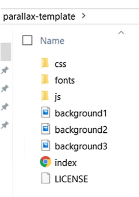

Thực hiện copy những file trong template vào project ASC:

- Tất cả các file CSS vào thư mục wwwroot/css
- Fonts vào thư mục wwwroot/fonts
- Tất cả các file JS vào thư mục wwwroot/js
- Tất cả các file ảnh \(logo và background\) vào thư mục  wwwroot/images

Có thể download logo và background tại 

[https://www\.pexels\.com/search/car/](https://www.pexels.com/search/car/)

[https://www\.iconfinder\.com/icons/285807/auto\_vehicle\_car\_automobile\_convertible\_icon\#size=128](https://www.iconfinder.com/icons/285807/auto_vehicle_car_automobile_convertible_icon#size=128)

Ta có cấu trúc mới của wwwroot

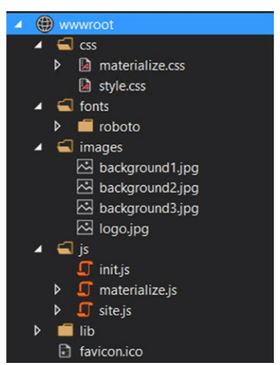

Tạo __\_MasterLayout\.cshtml__ trong thư mục View/Shared  để khai báo charset, font, css và javascript 

Dùng chung cho tất cả các view\.

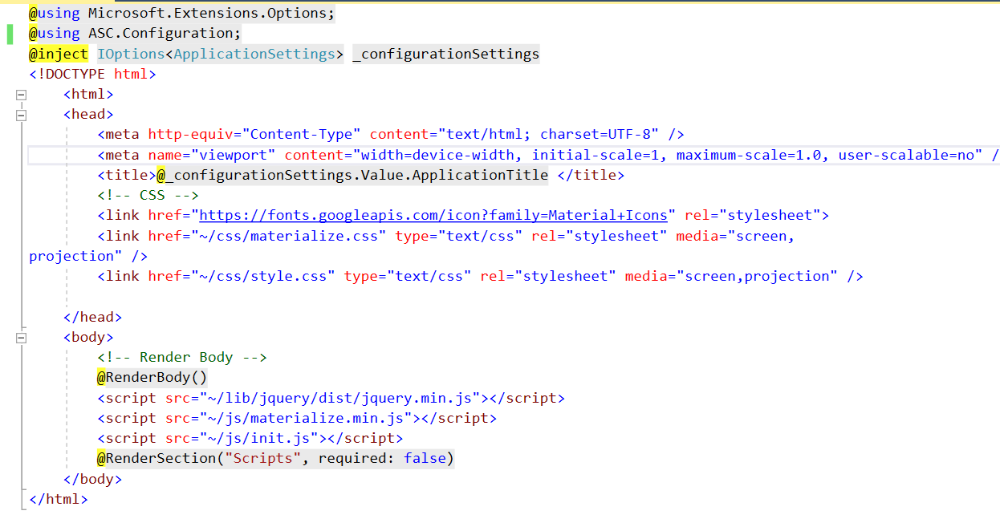

Chỉnh sửa \_Layout\.cshtml 

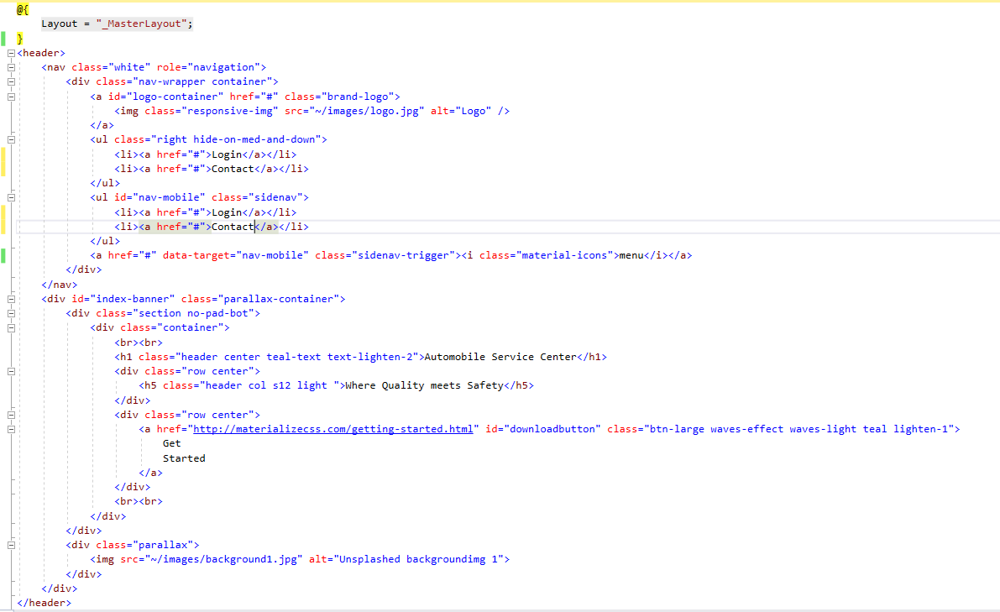

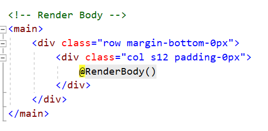

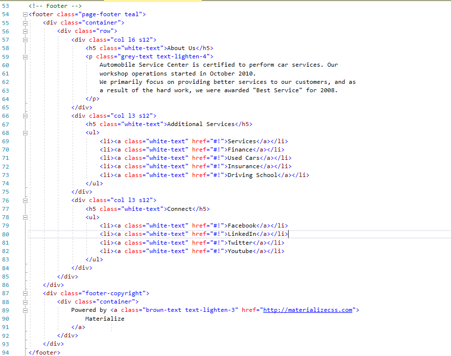

Thiết kế __Index\.cshtml__ của __Home__

@\{

    ViewData\["Title"\] = "Home Page";

\}

    

        <\!\-\- Icon Section \-\->

        

            

                

                    <h2 class="center brown\-text"><i class="material\-icons">group</i></h2>

                    <h5 class="center">Who we are</h5>

                    

                        We believe in providing seamless and high\-quality services

                        to our customers\. Our customer\-first approach will offer a unique

                        personalized experience that will bring more value to your car through a

                        smarter and quicker process\. We are committed to great quality\.

                    

                

            

            

                

                    <h2 class="center brown\-text"><i class="material\-icons">flash\_on</i></h2>

                    <h5 class="center">Our Competency</h5>

                    

                        By utilizing the elements and principles of modern

                        mechanical engineering, we are able to resolve complex technical challenges

                        through innovative solutions\. Additionally, our service engineers are

                        highly qualified, with advanced training in automobile engineering\.

                    

                

            

            

                

                    <h2 class="center brown\-text"><i class="material\-icons">settings</i></h2>

                    <h5 class="center">Easy to work with</h5>

                    

                        We provide detailed information and predictive analysis

                        to help our customers understand their cars\. We maintain continuous

                        communication and are always open to feedback\. We are always avaiable

                        to answer our customers' inquiries\.

                    

                

            

        

    

    

        

            

                <h5 class="header col s12 light">

                    Commited to delivering unprecendented

                    quality to our customers

                </h5>

            

        

    

    

        

    

    

        

            

                <h3><i class="mdi\-content\-send brown\-text"></i></h3>

                <h4>Customer Value</h4>

                

                    Automobile Service Center has always been a

                    value\-driven company\. Many of our values are based on years of research and

                    commitment\. Our values reflect the manner in which we run our business\.

                    We're proud of our professional ethics in dealing with our business

                    partners, investors, employees, and customers\. We provide customer\-valued

                    services built on our commitment to responsibility, sustainability,

                    trust, openness, diversity, reliability, determination, credibility, and

                    initiation\. Our dedication in providing quality services is based on our

                    great engineering\-compliance model and industry\-standard inspection and

                    quality\-control procedures\.

                

            

        

    

    

        

            

                <h5 class="header col s12 light">

                    Humility, Empathy, Hard Work, and Technology

                    are our core drivers\.

                </h5>

            

        

    

    

        

    

Cập nhật style cho file wwwroot/css/styles\.css để định dạng cho logo theo các độ phân giải khác nhau

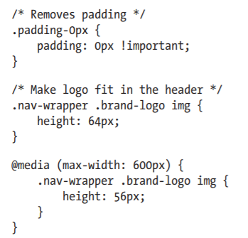

Kết quả sau khi chạy ứng dụng

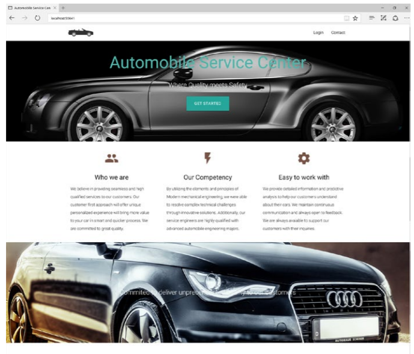

Tạo view quản trị __\_SecureLayout\.cshtml__ trong thư mục shared có dạng

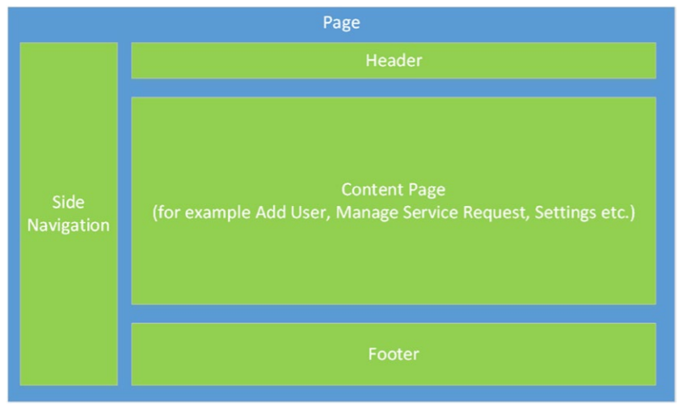

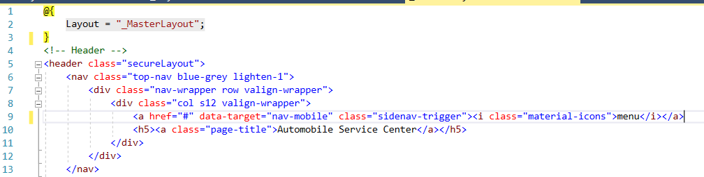

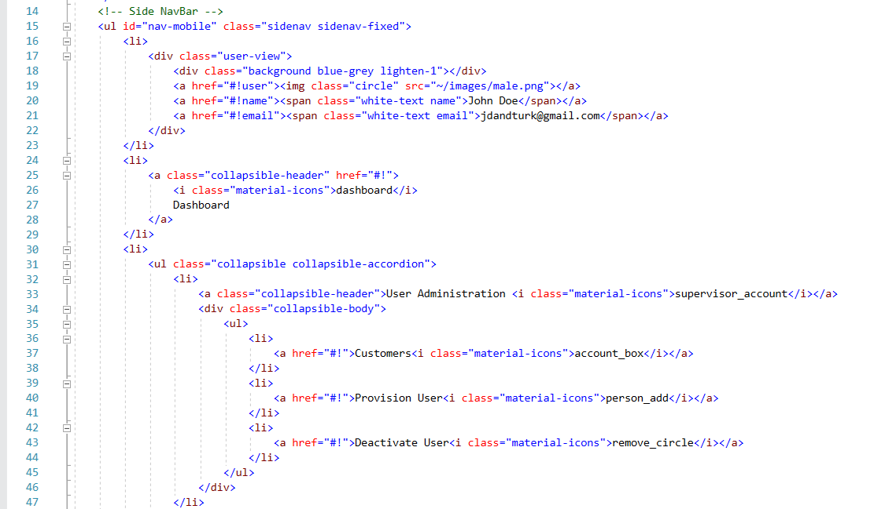

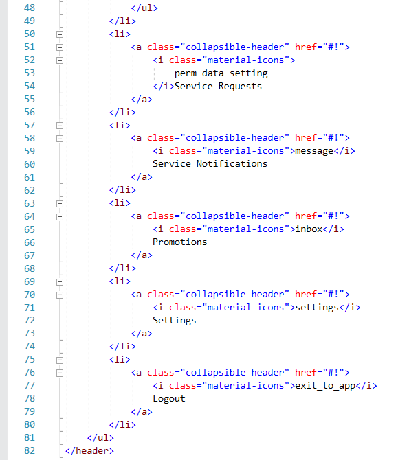

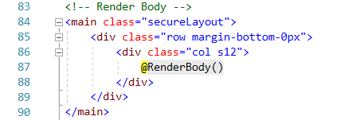

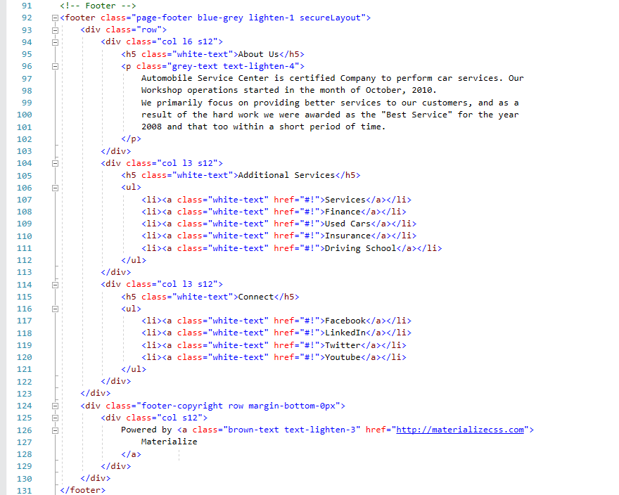

Bổ sung styles cho Style\.css\.

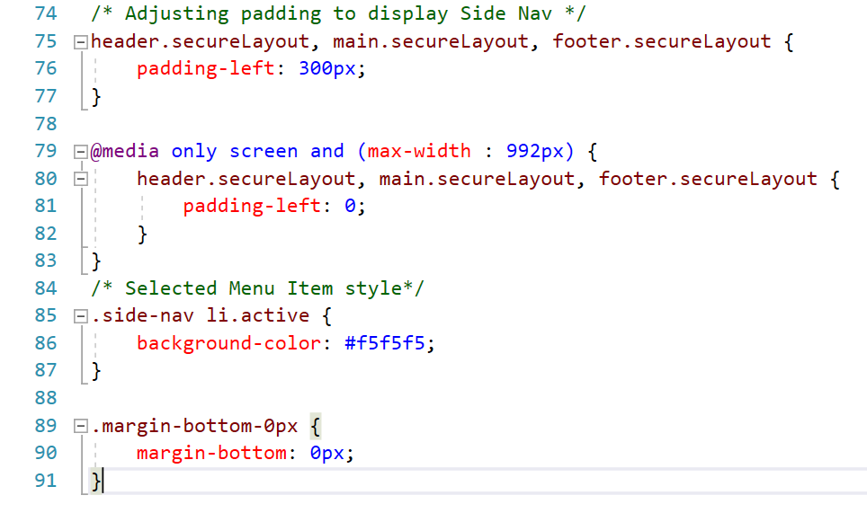

Tạo Dashboard Action trong Home Controller

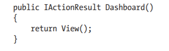

Tạo Dashboard\.cshtml trong Home

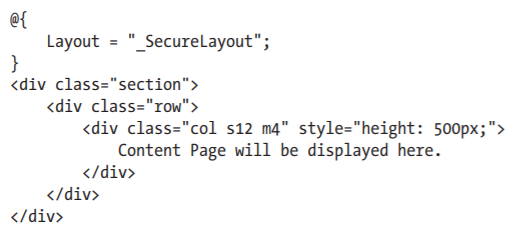

Thực hiện chạy trang __/Home/Dashboard__ có kết quả:

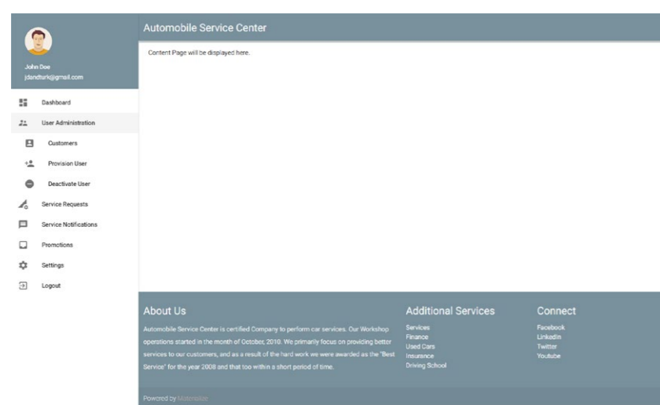

