__Securing the Application with ASP\.NET Core Identity and the OAuth 2\.0 Protocol__

1. __Creating and Setting Up the Admin Account__

__Admin__ phải có quyền truy cập vào toàn bộ trang web và có thể quản lý dữ liệu trong toàn bộ ứng dụng\. Quản trị viên cũng nên tạo và quản lý các kỹ sư dịch vụ\. Trong phần này, bạn sẽ học cách bắt đầu với ASP\.NET Core Identity, đánh giá tất cả các yếu tố cần thiết và tạo tài khoản Quản trị viên trong lần chạy đầu tiên của ứng dụng\.

__AccountController__ là một thành phần quan trọng của toàn bộ cơ sở mã xác thực và được tạo theo mặc định bởi Visual Studio\. Nó bao gồm các API và phương thức sau:

- __UserManager:__ Đây là một phần của Microsoft\.AspNetCore\.Identity API do Microsoft cung cấp và nó cung cấp các API để quản lý người dùng trong một kho lưu trữ liên tục
- __SigninManager:__ Đây là một phần của Microsoft\.AspNetCore\.Identity API do Microsoft cung cấp và nó cung cấp các API để quản lý hoạt động đăng nhập cho người dùng từ các nguồn khác nhau\. 
- __IEmailSender, ISmsSender và ILogger: __
	- __IEmailSender__ được AccountController sử dụng để gửi e\-mail xác nhận tài khoản và đặt lại mật khẩu\.
	- __ISmsSender __được sử dụng để xác thực hai yếu tố\. 
	- __ILogger __được sử dụng để ghi lại các thông báo và thông tin về quá trình đăng nhập của người dùng\. 
- Phương thức hành động: AccountController có các hành động bộ điều khiển mặc định được sử dụng để thực hiện các hoạt động liên quan đến xác thực khác nhau\. Các hành động được sử dụng cho những việc sau: Đăng ký, Đăng nhập, Đăng xuất, Đăng nhập Nguồn Bên ngoài, Quên Mật khẩu, Đặt lại Mật khẩu, Xác thực Hai yếu tố và Gửi và Xác minh Mã
- Right Click project ASC\.Web \-> Add \-> new Scaffolder Item \-> Identity \-> Identity \-> Add

__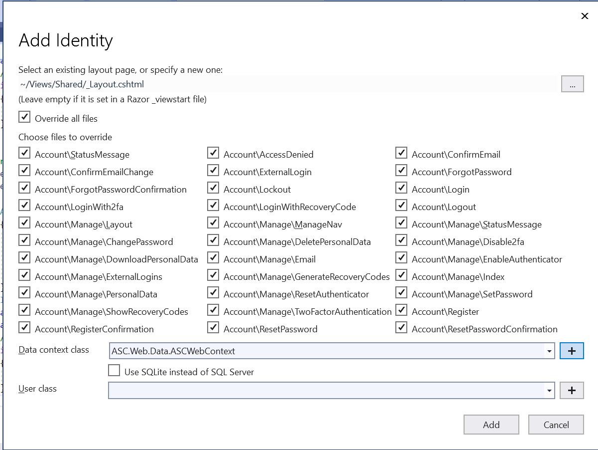__

__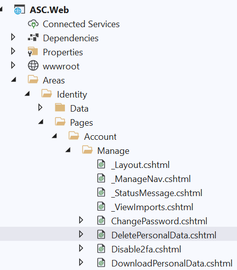__

1. __Cấu trúc lại services__

__Tạo class DependencyInjection__

__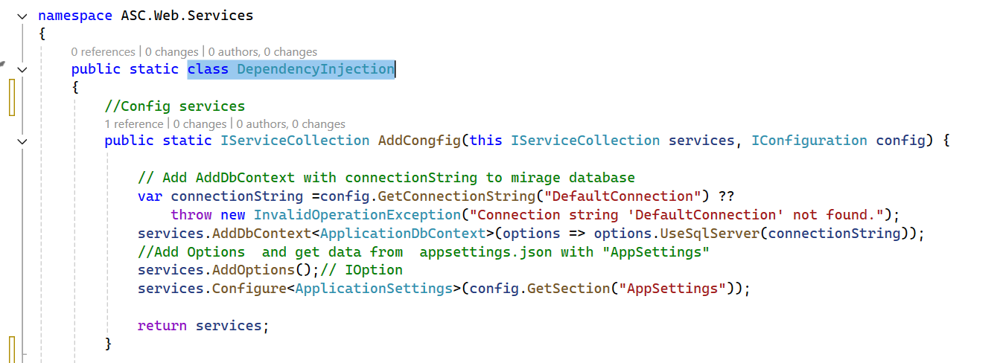__

__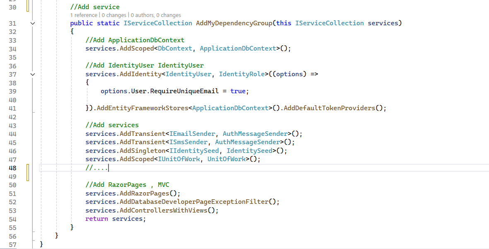__

__Cập nhật Program\.cs__

__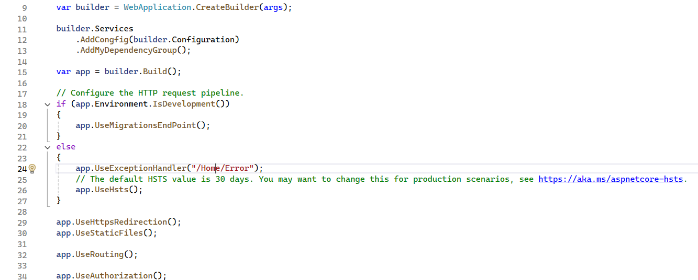__

__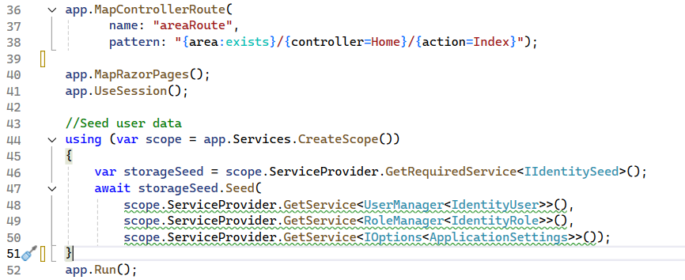__

1. __Xử lý Login, Logout, ResetPassword, ForgotPassword__
2. __Create Area ServiceRequests : xử lý các nghiệp vụ liên quan đến yêu cầu dịch vụ__

*Right Click  ASC\.Web \-> Add New Scaffolded Item \-> MVC Area*

__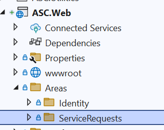__

1. __Cấu hình lại định tuyến Area => cập nhật program\.cs__

__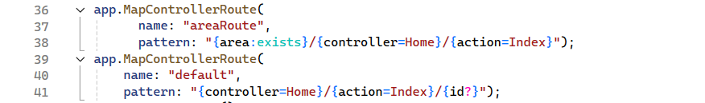__

1. __Xử lý session__

- __Cài Microsoft\.AspNetCore\.Session từ nuget cho ASC\.Web và ASC\.Utilitis__

__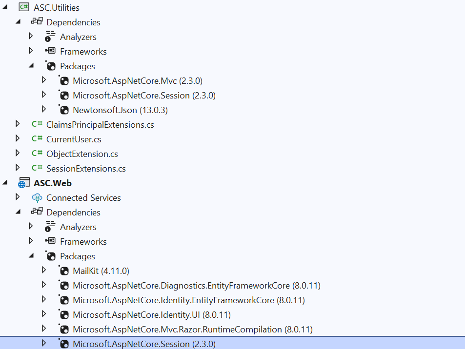__

- __Tạo class SessionExtensions để lấy và lưu session __

__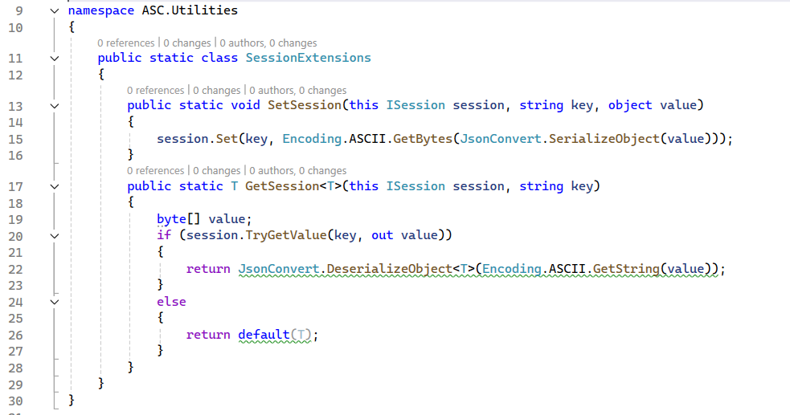__

- __Tạo class CurrentUser lưu trữ thông tin user hiện hành__

__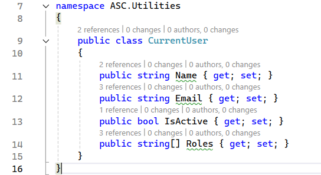__

- __Tạo class ClaimsPrincipalExtensions để lấy thông tin user đăng nhập từ  ClaimsPrincipal__

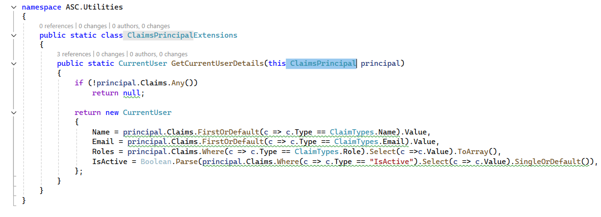

- __Add session trong DependencyInjection\.cs => phương thức __AddMyDependencyGroup

__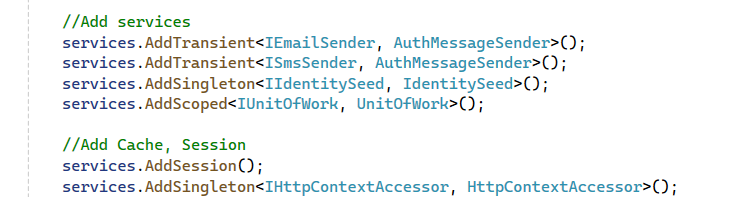__

1. __Cập nhật view  và code xử lý razor  login__

__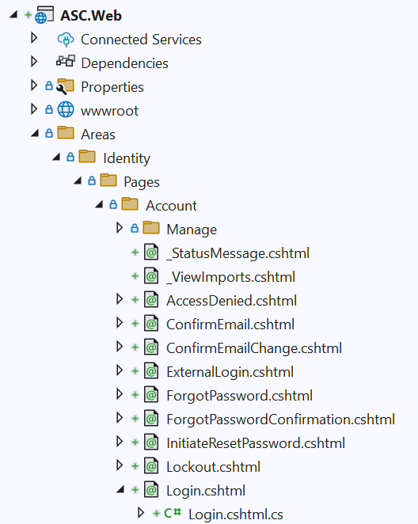__

Code xử lý

View

- __Cập nhật code xử lý Login\.cshtml\.cs__

__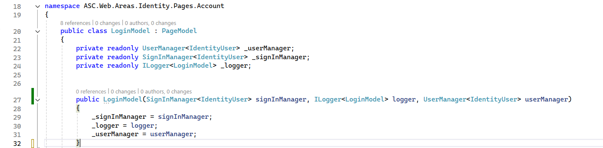__

__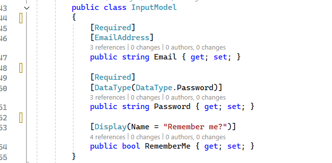__

- __Cập nhật lại Phương Thức GET của Login\.cshtml\.cs trong Areas\.Identity\.Pages\.Account __để clear đăng nhập và hiển thị form login\.

__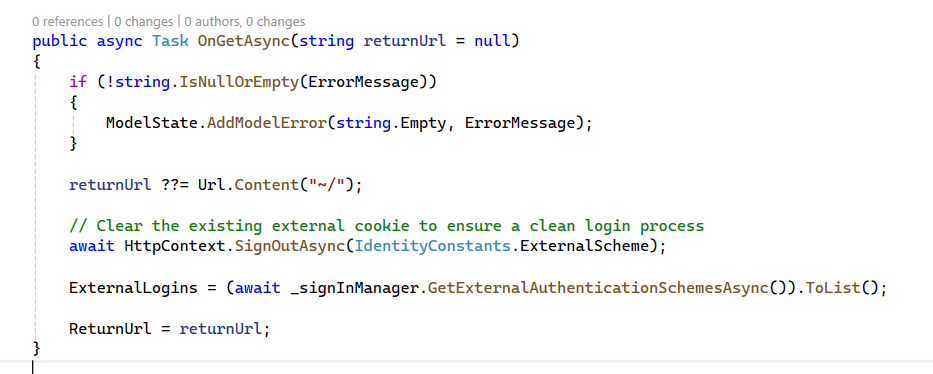__

- __Cập nhật lại Phương Thức POST của Login\.cshtml\.cs trong Areas\.Identity\.Pages\.Account __để khi đăng nhập thành công thì điều hướng đến View dashboard\.

__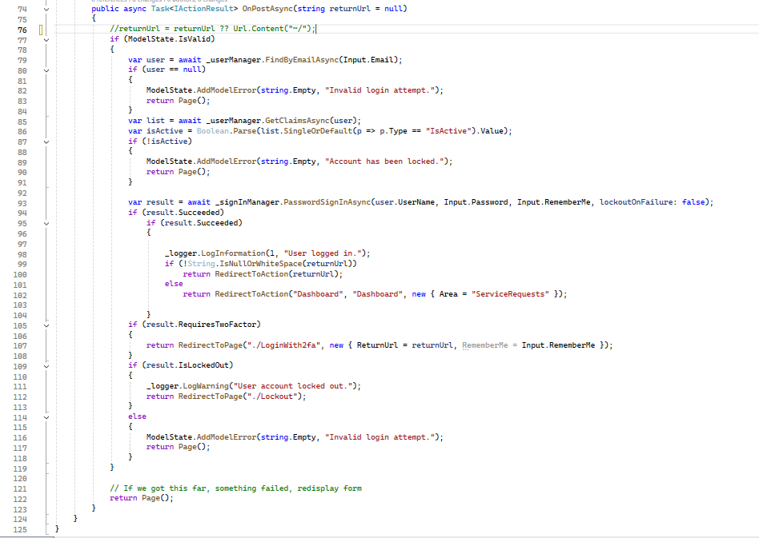__

- __Cập nhật view Login\.cshtml__

__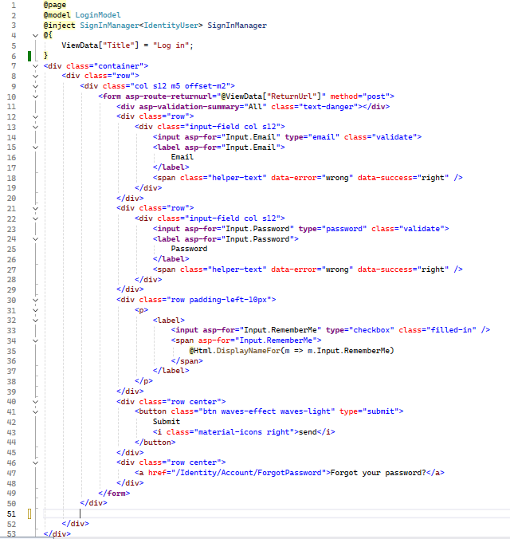__

- __Tạo controler BaseController\.cs  với thuộc tính Authorize trong thư mục ASC\.Web\.Controllers, __để mọi hành động bên trong bộ điều khiển này hoặc trong bất kỳ bộ điều khiển nào được kế thừa từ __BaseController__ này, đều yêu cầu đăng nhập

__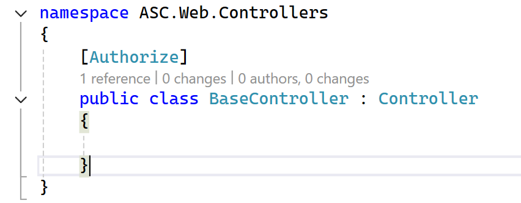__

- __Tạo controler  AnonymousController\.cs không có thuộc tính Authorize trong thư mục ASC\.Web\.Controllers, cho phép các controller kế thừa không yêu cầu đăng nhập__

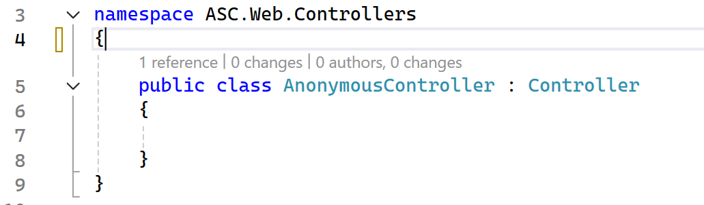

- __Tạo DashboardController\.cs kế thừa từ BaseController trong ASC\.Web\.Area\. ServiceRequests\.Controllers\. Tạo action Dashboard__

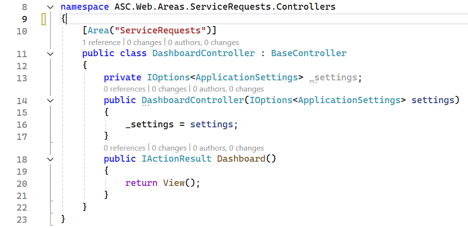

- __Tạo view cho action Dashboard \(Dashboard\.cshtml\)__

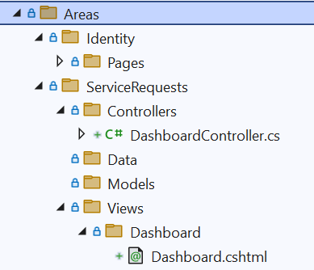

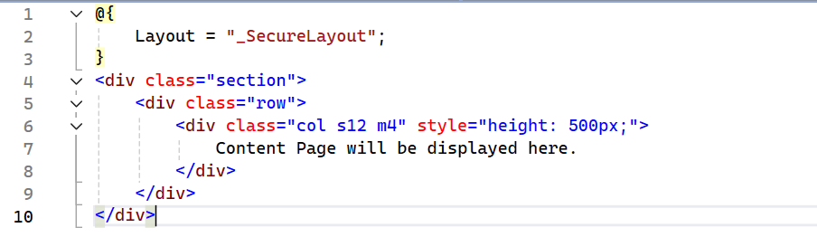

*Khi đó người dùng ẩn danh \(anonymous  user\) cố gắng truy view Dasboard\.cshtml đều sẽ điều hướng đến trang Login page\.*

- __Cập nhật HomeController\.cs kế thừa từ AnonymousController và *xóa action Dashboard\.*__

*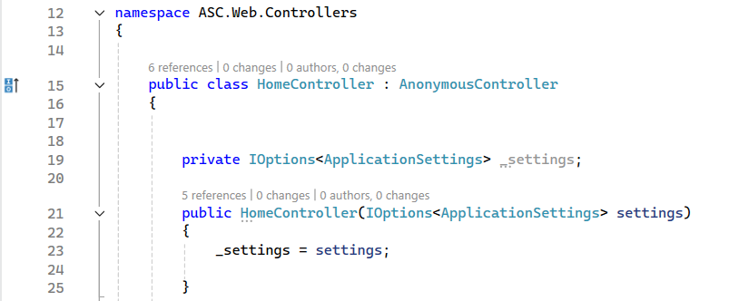*

*Khi đó bất cứ người dùn nào đều có thể truy vào các trang trong home mà không cần đăng nhập\.*

- __Thêm mã RenderSection sau vào cuối \_Layout\.cshtml và \_SecureLayout\.cshtml để hỗ trợ phần tập lệnh JQuery, để truyền phần tập lệnh từ master layout vào các layout kế thừa\.__

__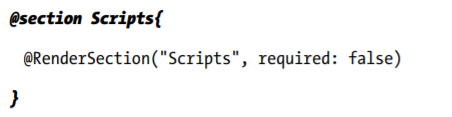__

- __Cập nhật Style\.css__

\.input\-field \.input\-validation\-error \{

    border\-bottom: 1px solid \#FF4081;

    box\-shadow: 0 1px 0 0 \#FF4081;

\}

\.input\-field \.valid \{

    border\-bottom: 1px solid \#00E676;

    box\-shadow: 0 1px 0 0 \#00E676;

\}

\.validation\-summary\-errors \{

    color: \#FF4081;

\}

- __Đảm bảo \_MasterLayout\.cshtml có tham chiếu JavaScript__

- __Cập nhật \_Layout\.cshtml để khi click login hiển thị form đăng nhập__

__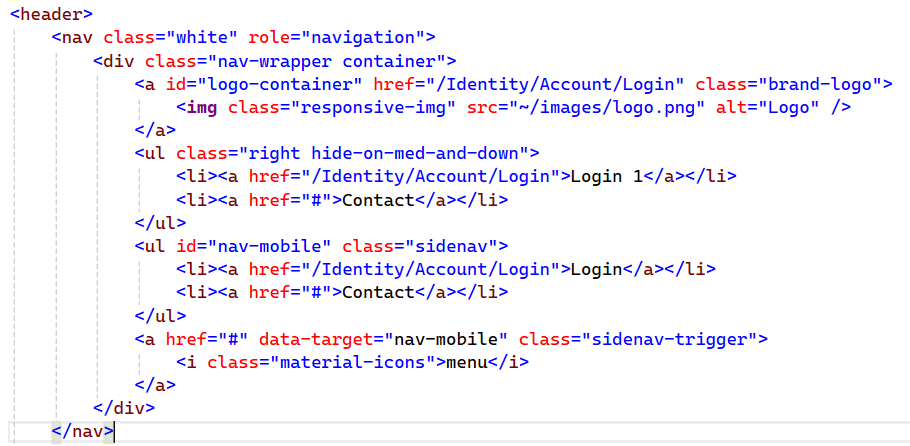__

- __Chạy ứng dụng và click vào Login__

__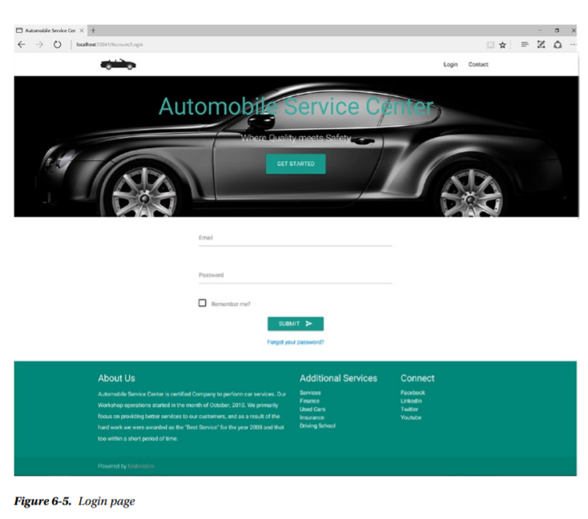__

- __Cập nhật lại Phương Thức POST của Login\.cshtml\.cs trong Areas\.Identity\.Pages\.Account __để khi đăng nhập thành công thì điều hướng đến View dashboard\.
- Thực hiện đăng nhập với email và pass để truy cập vào Dashboard

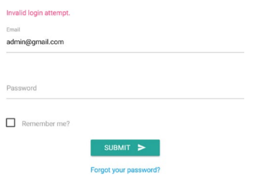

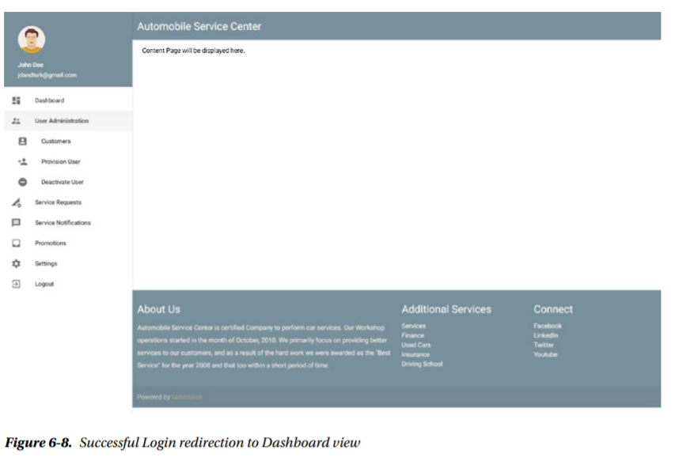

1. __Xử lý Navigation động theo phân quyền __

__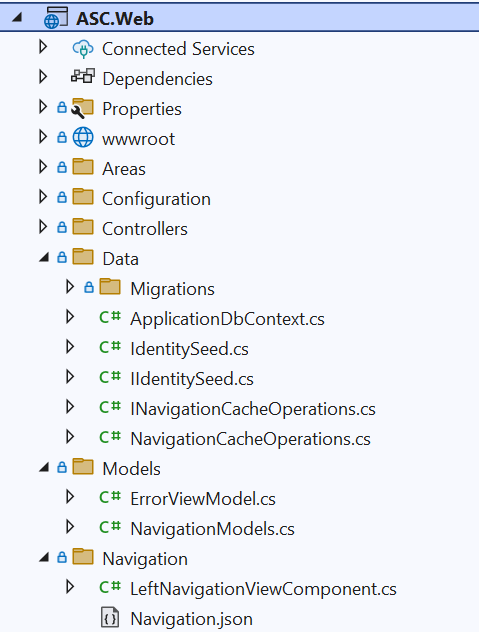__

- __Tạo Navigation\.json lưu cấu trúc menu__

\{

  "MenuItems": \[

    \{

      "DisplayName": "Dashboard",

      "MaterialIcon": "dashboard",

      "Link": "/ServiceRequests/Dashboard/Dashboard",

      "IsNested": false,

      "Sequence": 1,

      "UserRoles": \[ "User", "Engineer", "Admin" \],

      "NestedItems": \[\]

    \},

    \{

      "DisplayName": "User Administration",

      "MaterialIcon": "supervisor\_account",

      "Link": "",

      "IsNested": true,

      "Sequence": 2,

      "UserRoles": \[ "Admin" \],

      "NestedItems": \[

        \{

          "DisplayName": "Customers",

          "MaterialIcon": "account\_box",

          "Link": "/Accounts/Account/Customers",

          "IsNested": false,

          "Sequence": 1,

          "UserRoles": \[ "Admin" \],

          "NestedItems": \[\]

        \},

        \{

          "DisplayName": "Service Engineers",

          "MaterialIcon": "person\_add",

          "Link": "/Accounts/Account/ServiceEngineers",

          "IsNested": false,

          "Sequence": 2,

          "UserRoles": \[ "Admin" \],

          "NestedItems": \[\]

        \}

      \]

    \},

    \{

      "DisplayName": "Service Requests",

      "MaterialIcon": "local\_laundry\_service",

      "Link": "",

      "IsNested": true,

      "Sequence": 3,

      "UserRoles": \[ "User", "Engineer", "Admin" \],

      "NestedItems": \[

        \{

          "DisplayName": "New Service Request",

          "MaterialIcon": "insert\_invitation",

          "Link": "/ServiceRequests/ServiceRequest/ServiceRequest",

          "IsNested": false,

          "Sequence": 1,

          "UserRoles": \[ "User", "Engineer", "Admin" \],

          "NestedItems": \[\]

        \}

      \]

    \},

    \{

      "DisplayName": "Service Notifications",

      "MaterialIcon": "message",

      "Link": "/ServiceRequests/Dashboard/Dashboard",

      "IsNested": false,

      "Sequence": 4,

      "UserRoles": \[ "User", "Engineer", "Admin" \],

      "NestedItems": \[\]

    \},

    \{

      "DisplayName": "Promotions",

      "MaterialIcon": "inbox",

      "Link": "/ServiceRequests/Dashboard/Dashboard",

      "IsNested": false,

      "Sequence": 5,

      "UserRoles": \[ "User", "Engineer", "Admin" \],

      "NestedItems": \[\]

    \},

    \{

      "DisplayName": "Master Data",

      "MaterialIcon": "perm\_data\_setting",

      "Link": "",

      "IsNested": true,

      "Sequence": 6,

      "UserRoles": \[ "Admin" \],

      "NestedItems": \[

        \{

          "DisplayName": "Master Keys",

          "MaterialIcon": "data\_usage",

          "Link": "/Configuration/MasterData/MasterKeys",

          "IsNested": false,

          "Sequence": 1,

          "UserRoles": \[ "Admin" \],

          "NestedItems": \[\]

        \},

        \{

          "DisplayName": "Master Values",

          "MaterialIcon": "settings\_system\_daydream",

          "Link": "/Configuration/MasterData/MasterValues",

          "IsNested": false,

          "Sequence": 2,

          "UserRoles": \[ "Admin" \],

          "NestedItems": \[\]

        \}

      \]

    \},

    \{

      "DisplayName": "Settings",

      "MaterialIcon": "settings",

      "Link": "",

      "IsNested": true,

      "Sequence": 7,

      "UserRoles": \[ "User", "Engineer", "Admin" \],

      "NestedItems": \[

        \{

          "DisplayName": "Profile",

          "MaterialIcon": "system\_update\_alt",

          "Link": "/Accounts/Account/Profile",

          "IsNested": false,

          "Sequence": 1,

          "UserRoles": \[ "User", "Engineer", "Admin" \],

          "NestedItems": \[\]

        \},

        \{

          "DisplayName": "Reset Password",

          "MaterialIcon": "lock\_outline",

          "Link": "\#\!",

          "IsNested": false,

          "Sequence": 2,

          "UserRoles": \[ "User", "Engineer", "Admin" \],

          "NestedItems": \[\]

        \}

      \]

    \},

    \{

      "DisplayName": "Logout",

      "MaterialIcon": "exit\_to\_app",

      "Link": "\#\!",

      "IsNested": false,

      "Sequence": 8,

      "UserRoles": \[ "User", "Engineer", "Admin" \],

      "NestedItems": \[\]

    \}

  \]

\}

- __Tạo class NavigationModels\.cs để lưu trữ thông tin menu__

__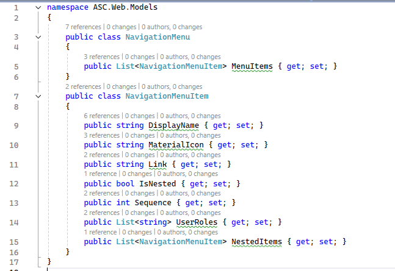__

- __Xử lý đọc thông tin menu từ  Navigation\.json vào hệ thống__

__Tạo interface __interface InavigationCacheOperations

__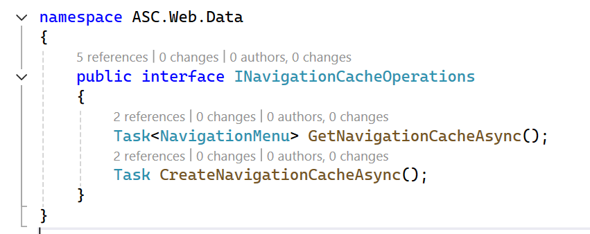__

	__Tạo class __NavigationCacheOperations

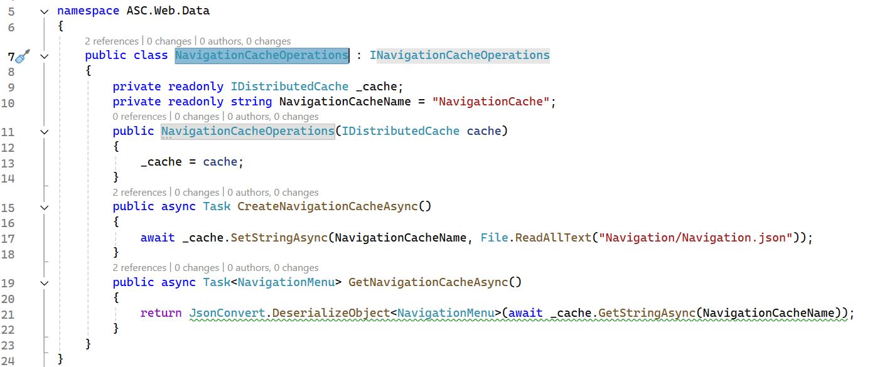

__Add service __NavigationCacheOperations và Cache __=> cập nhật class DependencyInjection => phương thức AddMyDependencyGroup__

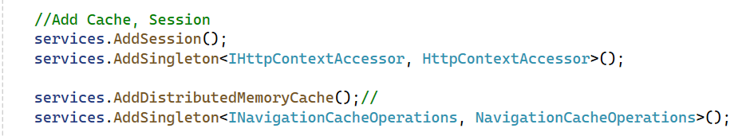

__Đọc thông tin menu từ Navigation\.jdon lưu vào bộ nhớ đệm \(Cache\)=> __

Cập __program\.cs__

__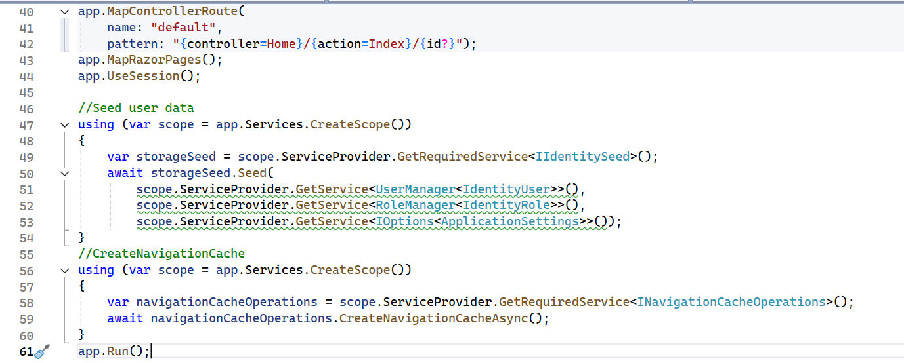__

- Tạo LeftNavigationViewComponent\.cs code xử lý cho mennu 

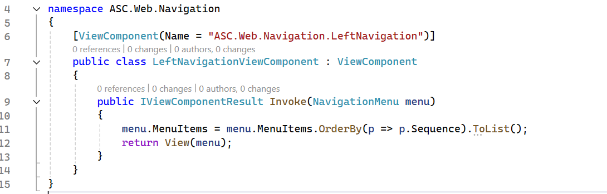

- Tạo __LeftNavigation__ View Component cho mennu 

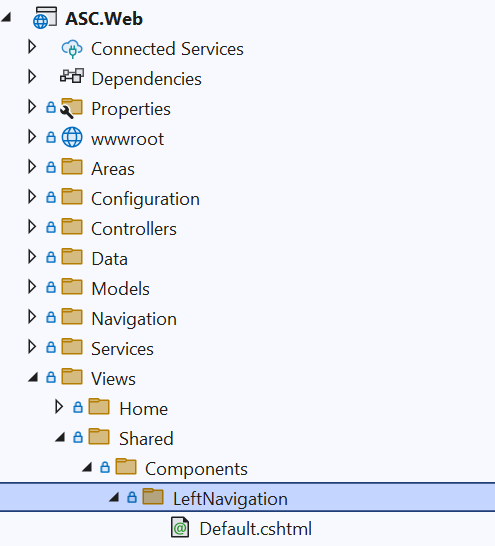

__Default\.cshtml__

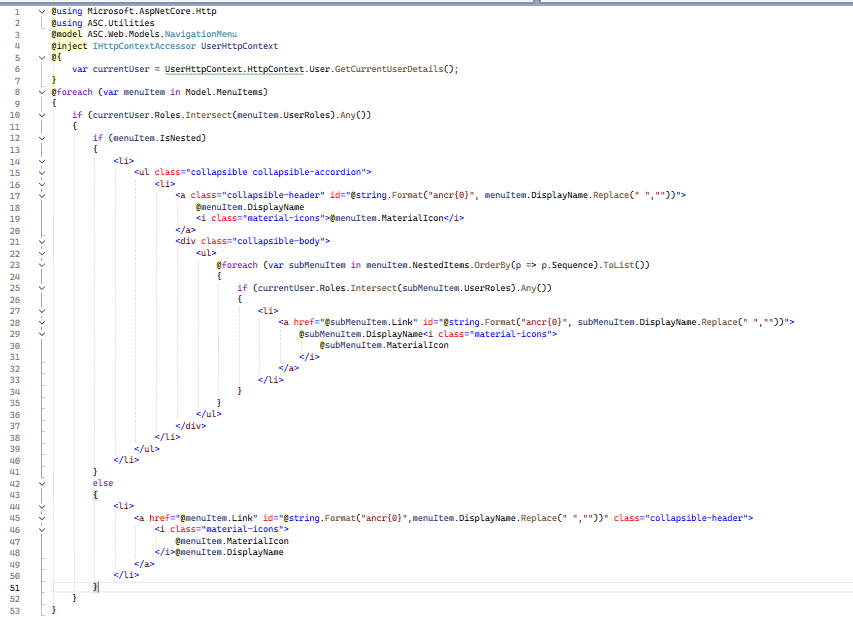

- Cập nhật \_SecureLayout\.cshtml

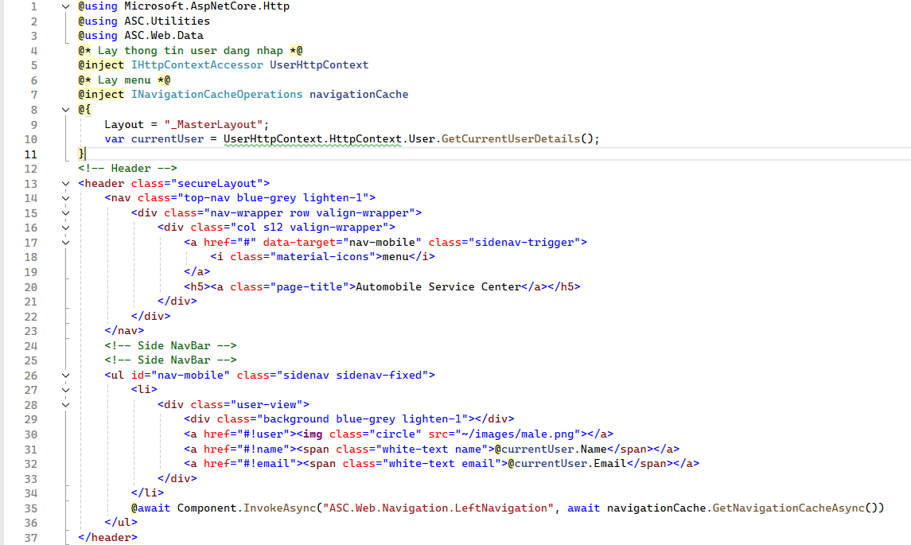

- __Cập nhật \_SecureLayout\.cshtml để xứ lý logout và resetpassword__

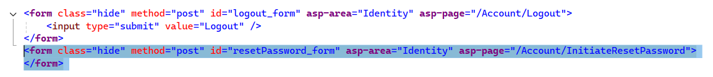

@section Scripts \{

    @RenderSection\("Scripts", required: false\)

    

    

\}

@RenderSection\("Scripts", required: false\)

- Cập nhật phương thức Post Logout\.cshtml\.cs trong Identity/Pages/Account

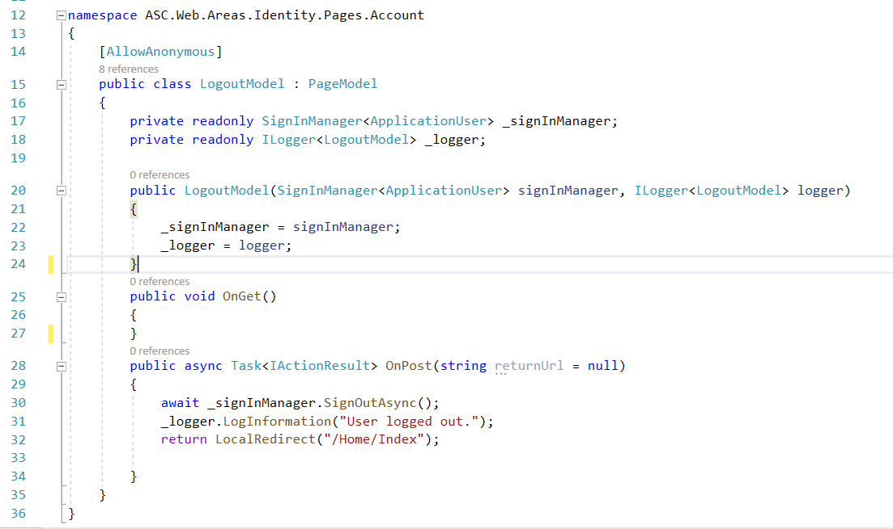

- Tạo Razor Page xử lý reset password InitiateResetPassword
- __*Right Account => Add new Item => Razor Page \- Empty*__

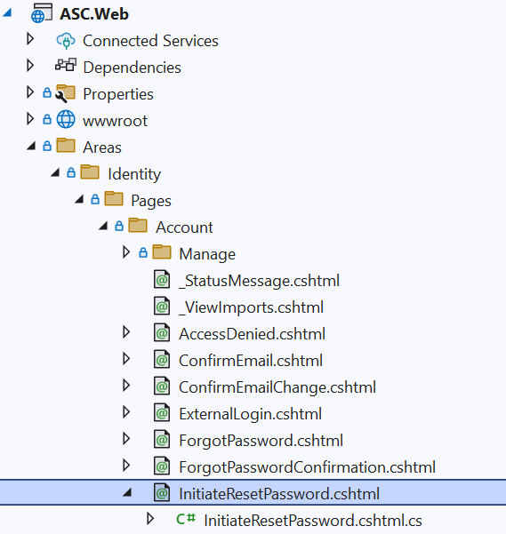

		Cập nhật cử lý code 

		__InitiateResetPassword\.cshtml\.cs	__

__	Chú ý IEmailSender  từ using ASC\.Web\.Services;__

__	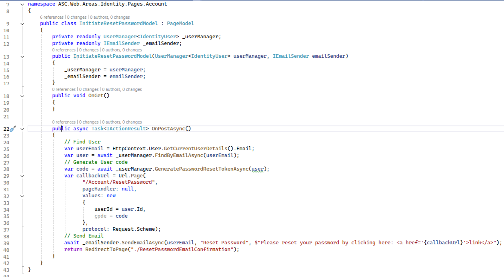__

- __Cập nhật Razor Page ResetPasswordEmailConfirmation\.cshtml trong Account__

__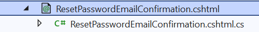__

__ResetPasswordEmailConfirmation\.cshtml__

__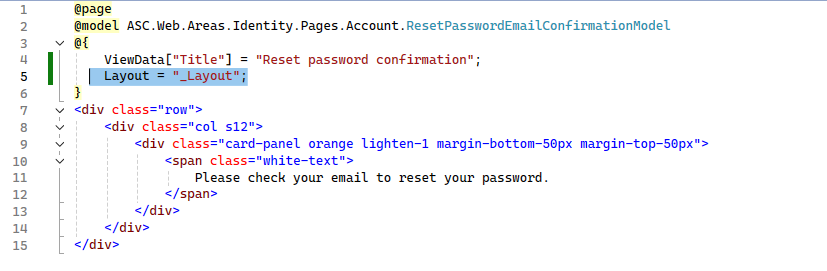__

- __Xử lý gửi mail__

__Cập nhật appsettings\.json__

__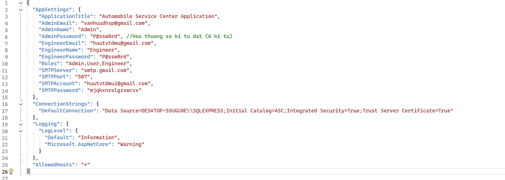__

Sử dụng một địa chỉ mail thực\. Xác thực 2 bước và tạo password truy cập cho app

- __Sử dụng Nuget cài MailKit cho ASC\.Web__

__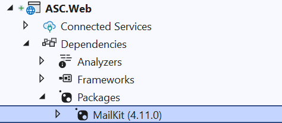__

- __Cập nhật phương thức gửi mail từ gmail từ class __AuthMessageSender

__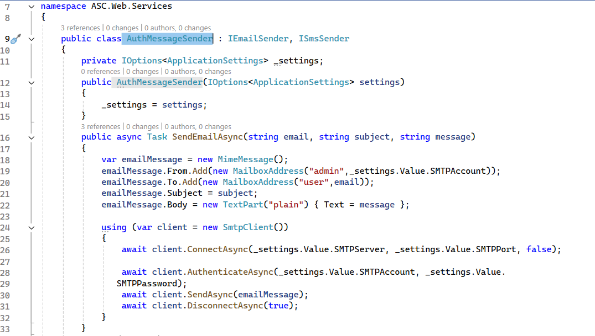__

__Chạy lại ứng dụng và đăng nhập 2 loại tài khoản khác nhau:__

__Tài khoản admin__

__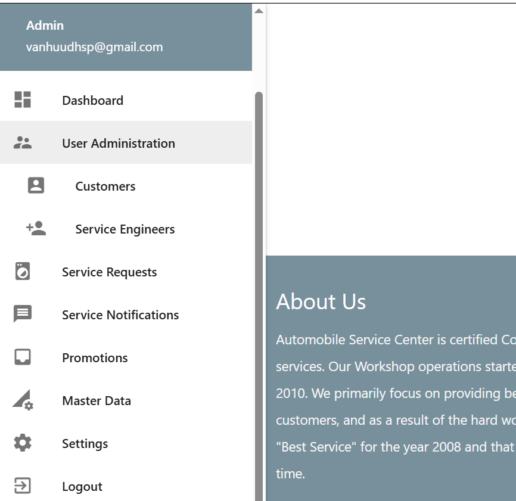__

__Tài khoản Engineer__

____

__Thực hiện reset password__

____

__Hiển thị màn hình xác nhận gửi đến địa chỉ mail__

____

		__Truy cập mail__

		

		__Và click vào link để truy cập màn hình ResetPassword__

		__Cập nhật xử lý code  ResetPassword\.cshtml\.cs__

__		__

____

__Cập nhật view ResetPassword\.cshtml__

____

__Kết quả chạy__


- Xử lý __forgot password khi click vào form login__

__//Account/Login\.cshtml__

 

- Cập nhật __ view cho Account/__ __ForgotPassword\.cshtml__

____

- Cập nhật code xử lý  __Account/ ForgotPassword\.cshtml\.cs__

____

- Cập nhật init\.js trong wwwroot/js  để chặn back and forward button và right\-click


__Thực hiện chức năng forgot password__


Check email 

