__Lab 2\. Domain\-Driven Architecture__

__Repository Partern \- UnitOfWork Partern__

1. __Thiết kế dự án theo kiến trúc sau __
	- __Domain\-Driven Architecture \-  Layered Architecture\)__

__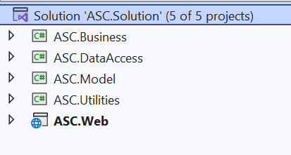__

- 
	- __Tầng ASC\.business – Class Library \.NET 8 truy cập DataAccess  và Model: chứa các class xử lý nghiệm vụ của hệ thống  __

__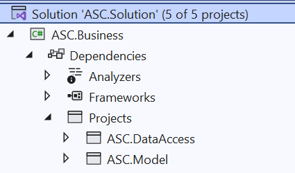__

- 
	- __Tầng ASC\.DataAccess – Class Library \.NET 8 truy cập Model và Utilities: chứa các class thao tác và truy vấn cơ sở dữ liệu__

__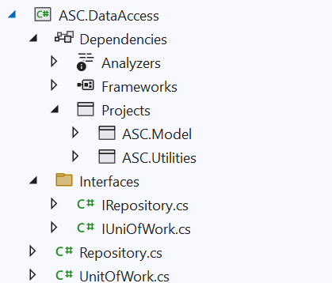__

- 
	- __Tầng ASC\.Model – Class Library \.NET 8 : chứa các class model tương ứng table trong CSDL\.__

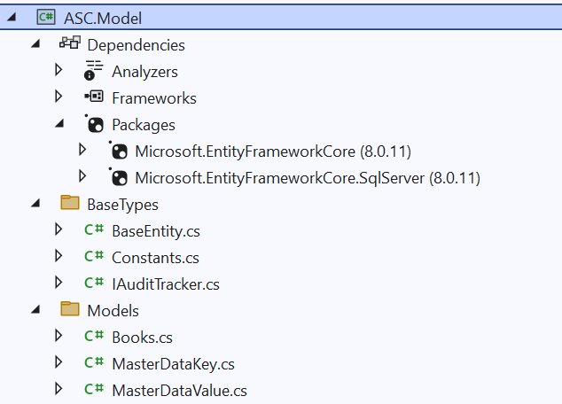

__	__Sử dụng Nuget để cài pakage EntiFrameworkCore

	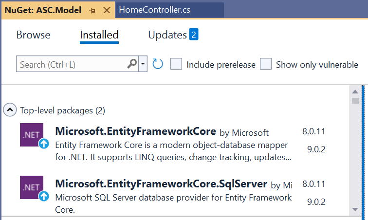

- 
	- __Tầng ASC\.Utilities – Class Library \.NET 8 : chứa các class xử lý tiện ích__

__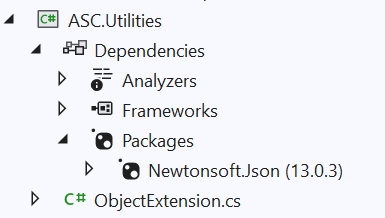__

Sử dụng Nuget để cài pakage Newtonsoft

- 
	- __ASC\.Web \- Asp\.Net MVC \.NET 8 : tầng web server truy cập Business, DataAccess, Model, Utilities__

__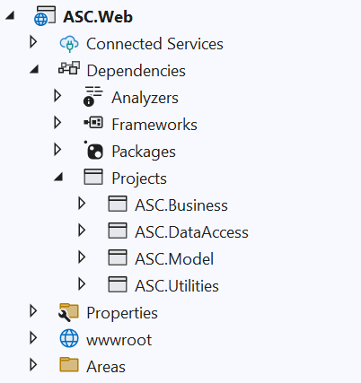__

- 
	- __Right click project \-> add \-> Project Reference__

__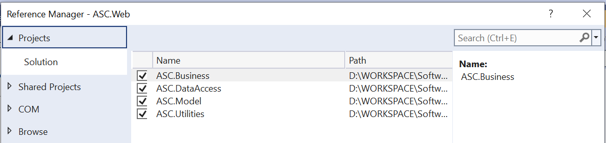__

1. __Code tầng ASC\.Model__
	- class BaseEntity

__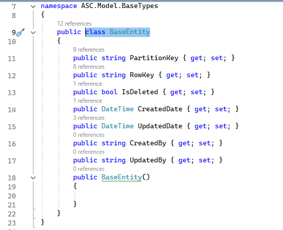__

- 
	- class Constants

__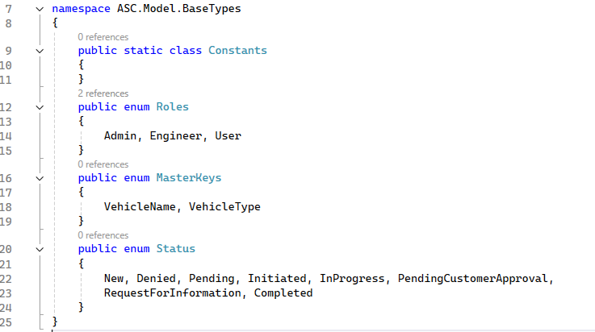__

- 
	- interface IauditTracker

__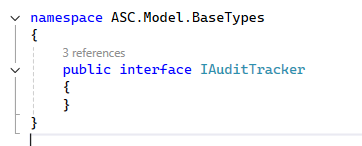__

- 
	- __Tạo các class Model__

__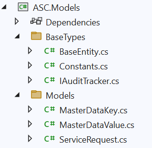__

- 
	- class ServiceRequest

__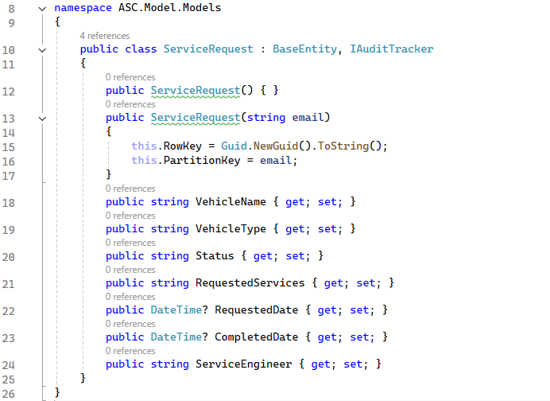__

- 
	- Class MasterDataKey

__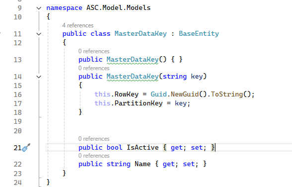__

- 
	- class MasterDataValue

__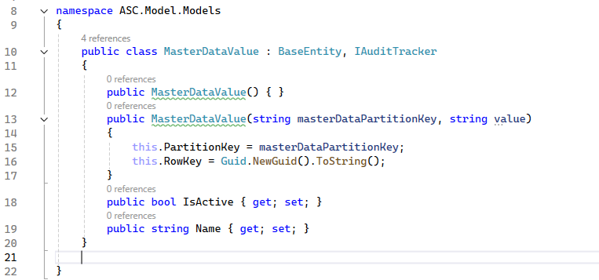__

1. __Code tấng ASC\.DataAccess \- Repository Partern \- UnitOfWork Partern__

__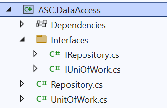__

- 
	- interface Irepository

__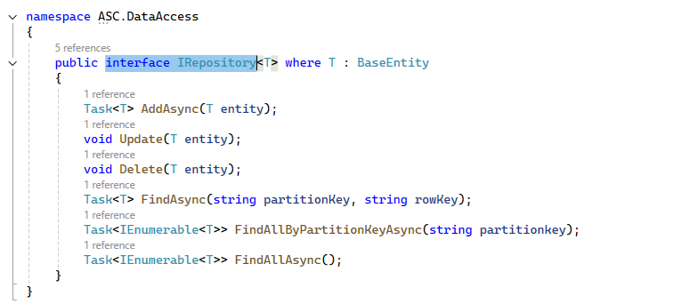__

- 
	- class Repository

__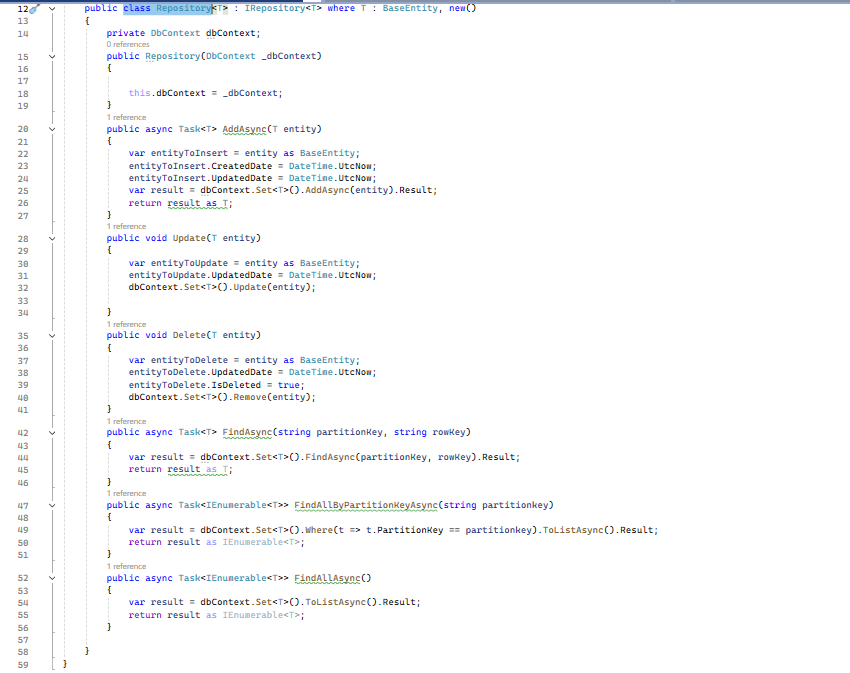__

- 
	- interface IunitOfWork

__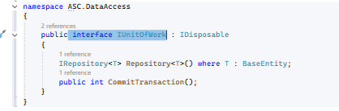__

- 
	- class UnitOfWork

__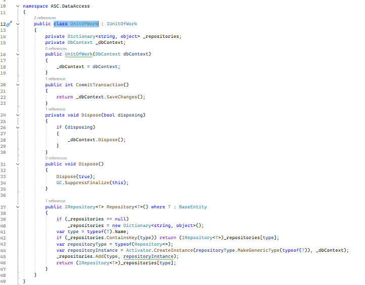__

1. __Code tầng ASC\.Web__
	- __Cấu hình appsetting\.json__

__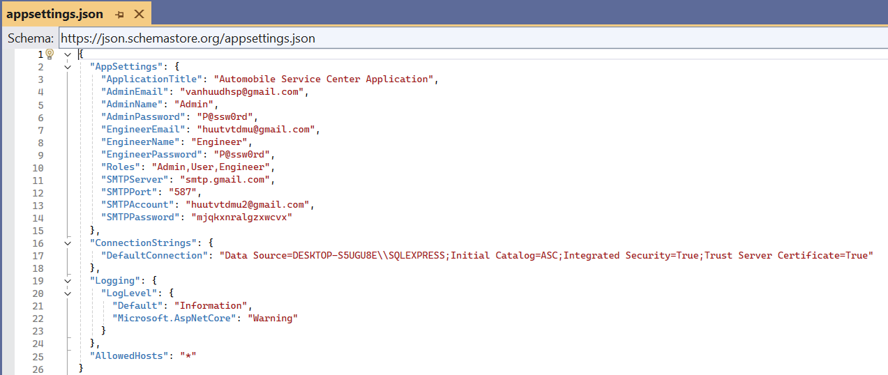__

- 
	- class ApplicationSettings

__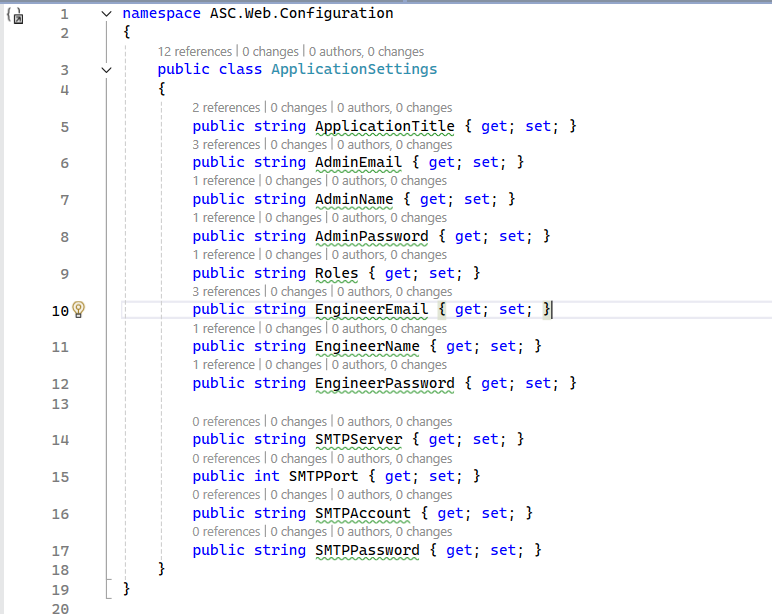__

- 
	- class ApplicationDbContext

__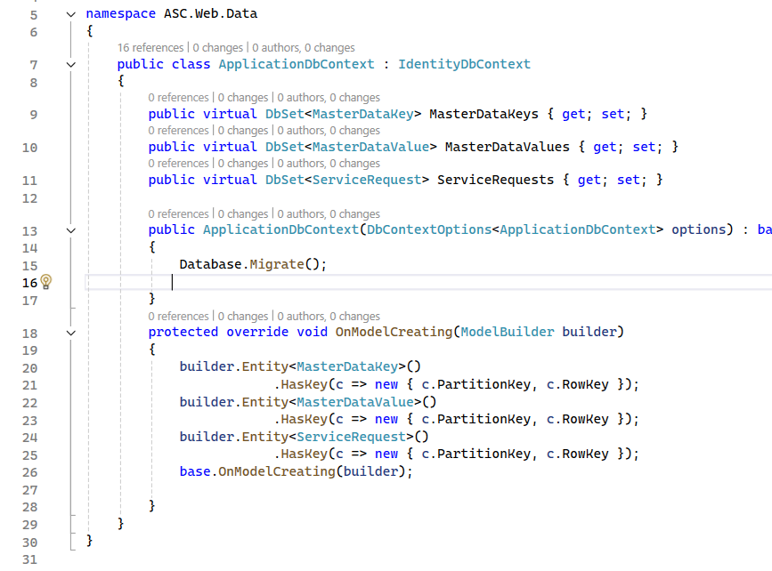__

- 
	- interface IIdentitySeed

__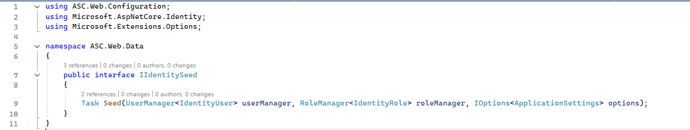__

- 
	- class IdentitySeed

__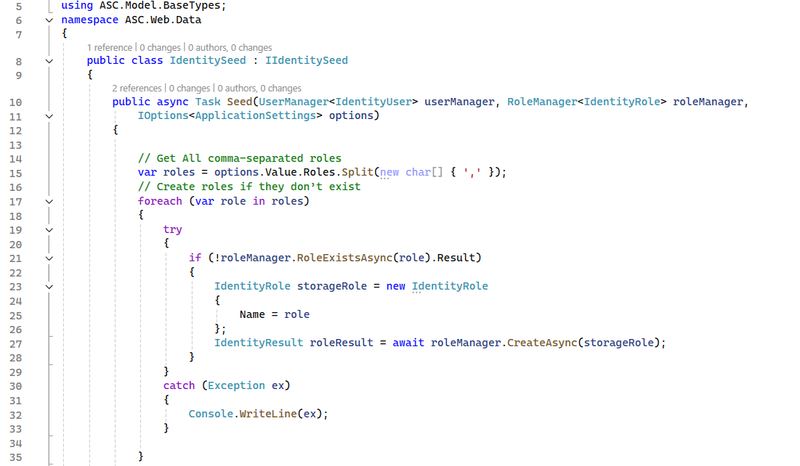__

__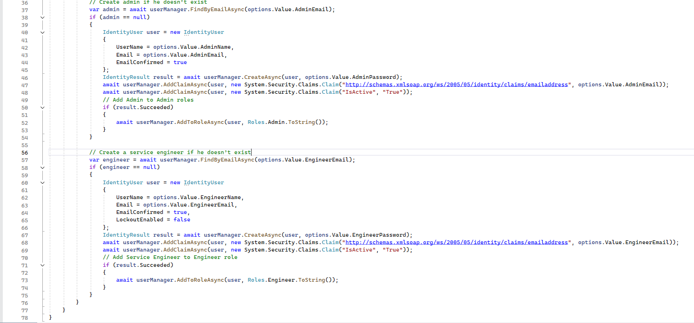__

1. __Thực hiện migration__

__Vào search \-> Feature Search \-> Package Manager Console__

__Thực hiện add migration đầu tiên cho cơ sở dữ liệu__

__PM> Add\-Migration InitialCreate__

__Lệnh trên sẽ tạo ra history migrations cho CSDL__

__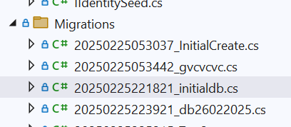__

__Và mỗi lần cập nhật model thực hiện lệnh này sẽ tạo ra class gồm 2 methob Up va Down__

__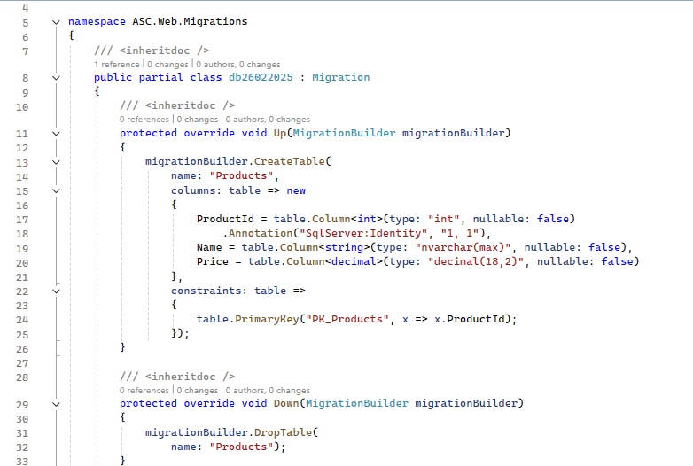__

__Để cập nhật CSDL sử dụng lệnh sau:__

__PM> __ Update\-Database  \-Verbose

__Hoặc chạy ứng dụng web, CSDL sẽ được cập nhật qua lệnh__

__	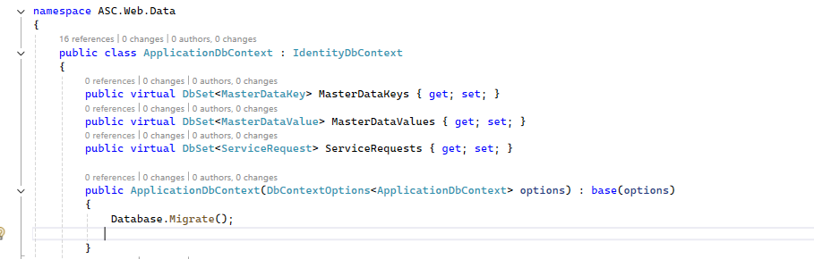__

1. __Cập nhật class Program\.cs__

__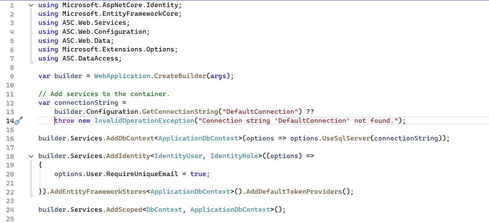__

__//Add IdentitySeed và UnitOfWork__

__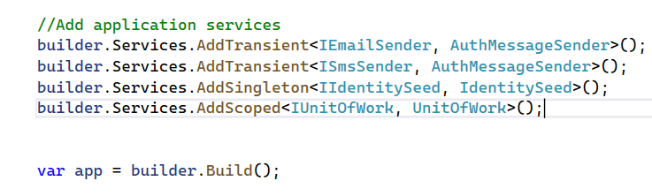__

__	//Config đưa dữ liệu mẫu từ appsetting\.jon lên CSDL__

__	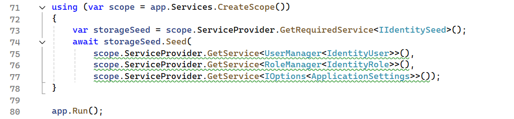__

__Yêu cầu: sau khi chạy ứng dụng sẽ khởi tạo Database tương ứng__

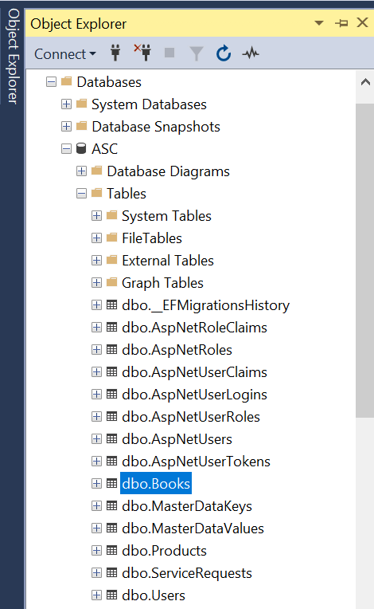

- Và đọc dữ liệu cấu hình từ file appsetting\.json đưa vào các bảng

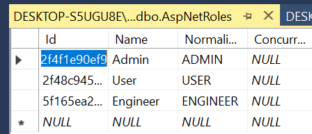

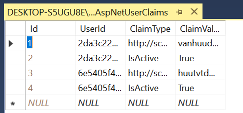

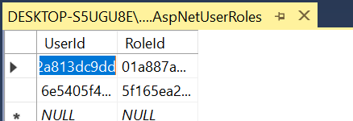

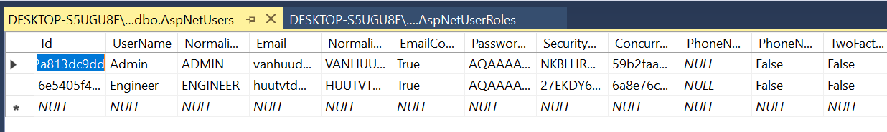

- __Thực hiện thêm model Product và cập nhật lại CSDL__

__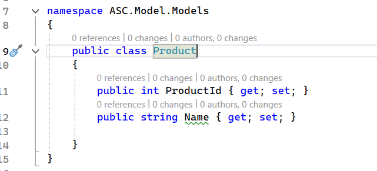__

