__Test\-Driven Approach Using xUnit\.net__

Trong các cách tiếp cận __phát triển ứng dùng  truyền thống__, hầu hết các __lỗ hổng__ \(gap\) về thiết kế và kỹ thuật thường được xác định__ kiểm thử__\. Điều này sẽ *không chỉ ảnh hưởng đến *__*chất lượng*__* của ứng dụng mà còn phải gánh chịu *__*chi phí*__* hoạt động nghiêm trọng đối với *__*tiến độ dự án và mục tiêu kinh doanh*__\.

__Phần 1\. Test\-driven development \(TDD\)__

__ TDD __giúp xác định các __gap__ về thiết kế và kỹ thuật __*ngay trước khi bắt đầu phát triển một chức năng cụ thể*__*\.* __TTD__ bao gồm các bước lặp ,* trong đó các trường hợp thử nghiệm đơn vị \(*__*unit test\) *__*được viết cho một tính năng ứng dụng* và *sau đó code tính năng sau cho vượt qua tất cả các *__*unit test*__\. 

- __Ưu điểm: __

• TDD *xác định các rủi ro thiết kế ở giai đoạn đầu của quá trình phát triển, do đó giảm thời gian phát triển tổng thể*  do giảm nhu cầu làm lại công việc\.

• Các components riêng lẻ được kiểm tra, *giúp kiểm soát tốt hơn chất lượng của mã*\.

• Chất lượng của thiết kế kỹ thuật sẽ được cải thiện, vì *unit testing* sử dụng cơ chế __*dependency injection*__ đối với các component\.

• Việc hiểu và bảo trì mã \(maintaining legacy\) có thể dễ dàng hơn nhiều với các *unit testing*\.

• __*Tự động hóa các unit tests*__ cùng với các __*build definitions*__ đảm bảo rằng mã phù hợp nằm trong kho lưu trữ\.

• Unit tests có thể được coi là tài liệu\.

• Tính khả dụng của *new unit\-testing frameworks* làm cho các *unit testing* dễ viết\.

- __Good unit\-test thỏa mản các tiêu chí sau:__

• Các __unit\-test __nên bao gồm các *khối mã nhỏ và độc lập*\.

• Một trường hợp thử nghiệm nên có __*một khẳng định*__, điều này nên được giới hạn trong thử nghiệm đang thực thi\. Trong một số trường hợp hiếm hoi, chỉ nên đưa __*ra tối đa hai khẳng định*__\.

• Các __unit\-test__ phải độc lập với cơ sở hạ tầng, có nghĩa là unit\-test *không được có bất kỳ phụ thuộc vật lý* nào như cơ sở dữ liệu hoặc hệ thống tệp\.

• Các __unit\-test__ phải có thể __chạy độc lập __bằng cách sử dụng *test runners* và phải *hỗ trợ tự động hóa*\.

• Mã mà chúng tôi viết trong các __test classes__ không được bao gồm trong mã ứng dụng thông thường\.

• Các cuống dữ liệu thử nghiệm thích hợp\(__Proper test data stubs__\)  nên được tạo và sử dụng *để thử nghiệm các tình huống khác nhau* \.

• Các __unit\-test__ nên sử dụng các __*mocking frameworks*__ để __*inject dependencies*__ như __*web*__

__*services*__ hoặc __*data access layer*__\. Fake implementations nên được tạo cho các API, chẳng hạn như __*session*__ hoặc __*cache*__, thường được sử dụng và sẽ tồn tại cho các thử nghiệm tiếp theo\.

• Các __unit\-test__ nên được tích hợp như *một phần của quá trình xây dựng* và các reports phải được tạo cho các chỉ số về độ bao phủ của mã\.

- __Test\-Driven Development Life Cycle__

TDD bao gồm ba giai đoạn, *các giai đoạn này lặp lại theo chu kỳ đối* với mọi thay đổi trong yêu cầu chức năng: 

1\. Test\-case generation 

2\. Application code development 

3\. Code optimization

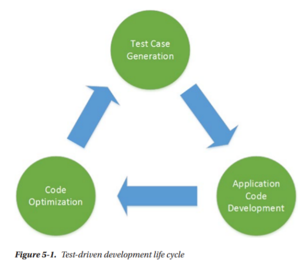

Trong quá trình __*test\-case generation*__, trước tiên nhà phát triển viết các test case *nhắm mục tiêu đến yêu cầu kinh doanh *bằng cách sử dụng __*frameworks *__như xUnit\. Các trường hợp thử nghiệm này *không nhất thiết phải bao gồm toàn bộ chức năng*, nhưng nên *hướng đến một số mục tiêu của kết quả chức năng cuối cùng*\. Các trường hợp thử nghiệm này nên được *phát triển trước khi bắt đầu với mã ứng dụng*\. Sau khi các __*test cases*__ được hoàn thành, chúng được thực thi với kỳ vọng rằng tất cả sẽ thất bại\. *Mục đích chính của giai đoạn này là đảm bảo rằng *__*các yêu cầu chức năng*__* được giám sát \(vượt qua\)  các *__*test cases*__\.

__Application code development__ là giai đoạn tiếp theo; một nhà phát triển bắt đầu viết mã ứng dụng để đáp ứng các mục tiêu của các trường hợp kiểm thử\. Giai đoạn này đảm bảo rằng nhà phát triển __*chỉ viết mã cần thiết để vượt qua các test cases*__\. *Khi mã ứng dụng đã sẵn sàng, các *__*test cases*__* một lần nữa được thực thi với kỳ vọng rằng tất cả các *__*test cases*__* sẽ vượt qua*\. 

Trong giai đoạn __code optimization__, mã ứng dụng được cấu trúc lại để đáp ứng các tiêu chuẩn mã hóa và cải thiện hiệu suất\. *Các *__*test cases*__* được thực thi lại và nếu bất kỳ trường hợp thử nghiệm nào không thành công, mã ứng dụng sẽ được hiệu chỉnh cho phù hợp*\.

Sau giai đoạn code optimization, một tập hợp __*test cases*__ mới sẽ được phát triển để triển khai bất kỳ chức năng nào còn thiếu\. Do đó, toàn bộ quá trình diễn ra lặp đi lặp lại cho đến khi đạt được tất cả các chức năng\.

__Phần 2\. Understanding xUnit\.net__

__xUnit\.net__ là một công cụ kiểm tra đơn vị *miễn phí, mã nguồn mở*, dựa trên cộng đồng cho __*\.NET Framework và \.NET Core*__\. Được phát triển bởi James Newkirk và Brad Wilson, xUnit là công nghệ mới nhất để kiểm tra đơn vị trong __*C \#, F \#, VB\.NET*__ và các ngôn ngữ \.NET khác\. Nó là một phần của __\.NET Foundation__ và xUnit\.net cung __cấp một API toàn diện__ để viết các trường hợp thử nghiệm đơn vị và trình chạy thử nghiệm của nó có thể *dễ dàng tích hợp với Visual Studio và các hệ thống xây dựng tự động bao gồm TFS và *__*Travis*__ \.

- __Getting Started with xUnit\.net and MOQ__

Để tuân theo tiêu chuẩn giữ mã __unit\-test__ tách biệt với mã ứng dụng, thực hiện tạo __*xUnit Test Project *__với tên __ASC\.Tests__ như hình: 

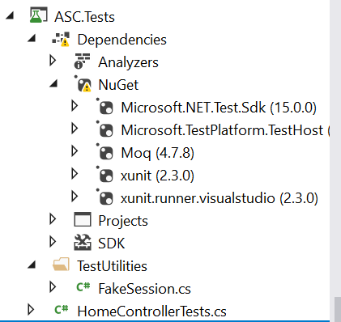

- Cài __*xUnit*__, __*xUnit\.Runner\.VisualStudio*__*, * NuGet cho __ASC\.Tests__

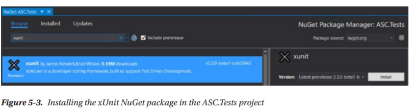

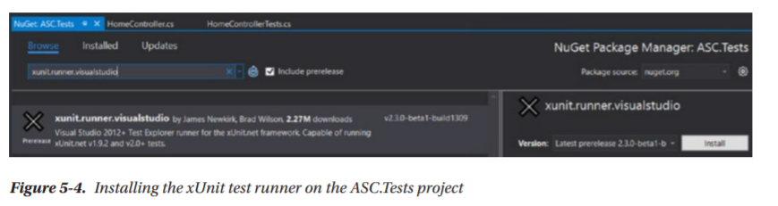

- __Để kiểm tra các controller, thực hiện *add a reference ASC\.Web vào ASC\.Tests*\.__

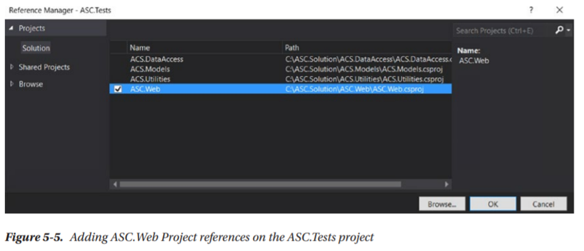

- __Tạo class *HomeControllerTests\.cs*\. Dựa trên các thông số kỹ thuật chức năng, xác định rằng *HomeController* phải trả về một loại *ViewResult*, không nên trả về bất kỳ mô hình nào null và không được chứa *validation errors*\. __

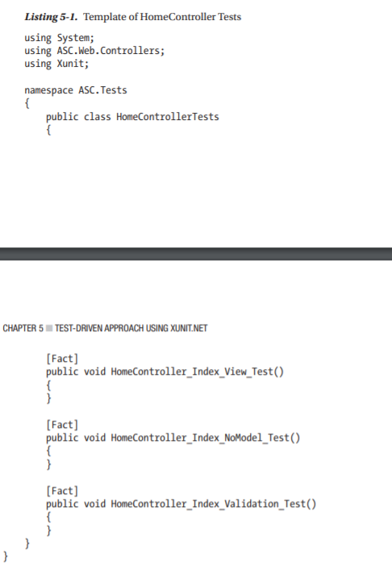

*Chú ý: thuộc tính  *__*Fact*__* được sử dụng để kiểm tra các điều kiện bất biến, và phương thức kiểm tra không có đối số\. Mặt khác, thuộc tính *__*Theory*__* cho phép chuyển các dữ liệu khác nhau đến phương thức kiểm tra dưới dạng đối số\.*

- Quy ước đặt tên test case: __ControllerName\_ActionName\_TestCondition\_Test__
- Xét contructor HomeController: sử dụng phương pháp __dependency injection__ của ASP\.NET Core để đưa cấu hình appsettings\.json qua mẫu IOptions

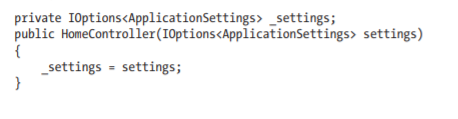

Có 3 giải pháp cho vấn đề này:

- Đọc tệp cấu hình __appsettings\.json__ thực tế từ dự án web vào __IOptions <ApplicationSettings>__ vào truyền vào __HomeController  Constructor__\.
- Tạo __mock data \(dữ liệu giả\)__ cho IOptions <ApplicationSettings> và truyền __HomeController__\.
- Cấu trúc lại mã __HomeController__ để IOptions <ApplicationSettings> không phải tiêm vào contrstuctor mà sử dụng __property injection__\.

Như thảo luận trong chương *các  *__*unit tests*__* phải độc lập với cơ sở hạ tầng và phải có sự phụ thuộc tối thiểu vào hệ thống tệp\. *__Mocking__ *giảm bớt sự phụ thuộc vào cơ sở hạ tầng và cấu trúc lại mã ứng dụng một cách mạnh mẽ*\. 

- Cài __*MOQ*__ framework vào __*ASC\.Tests*__ project\.

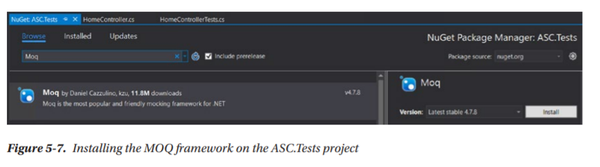

- Cập nhập class HomeControllerTests\.cs

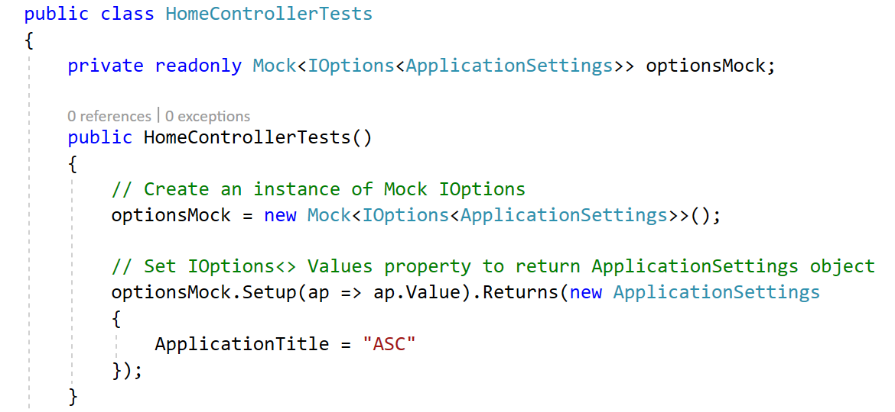

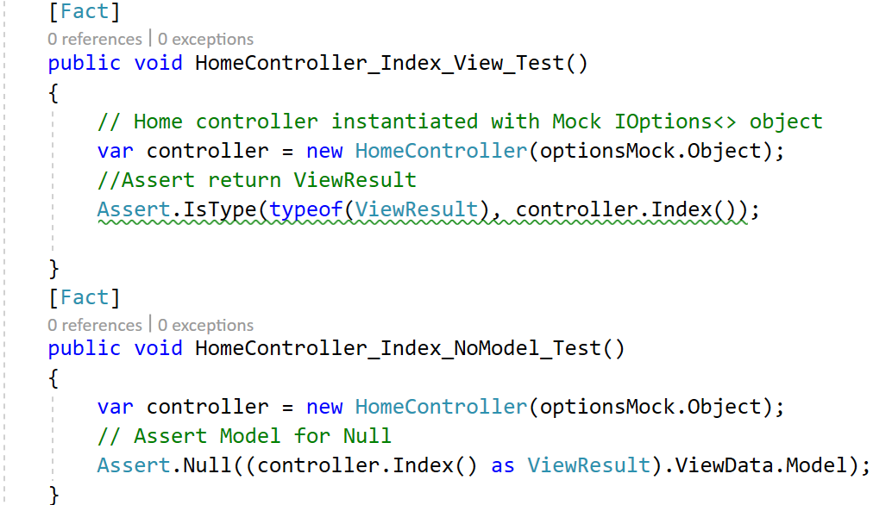

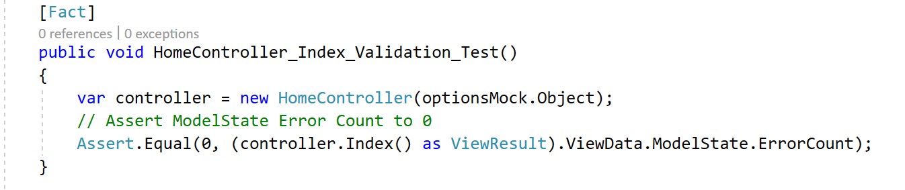

- Sau khi hoàn thành các chức năng như HomeController, run all test\-case thường các test case sẽ fail\. Và các chức năng cần tối ưu code để vượt qua tất cả các test case\.

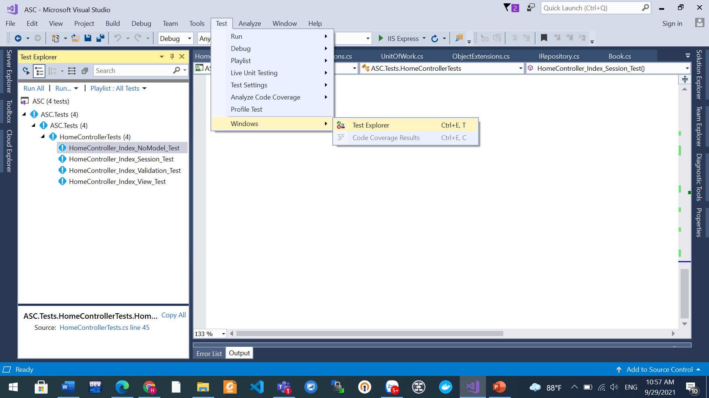

Kết quả vượt qua các test \- case

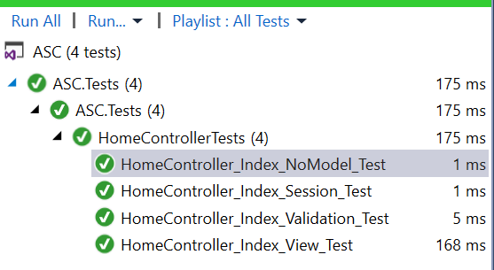

// Cập nhật HomeController\.cs

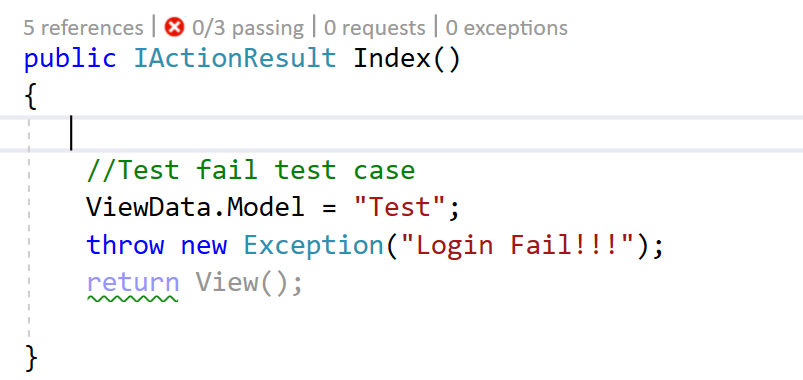

//Run lại tất cả các test\-case fail

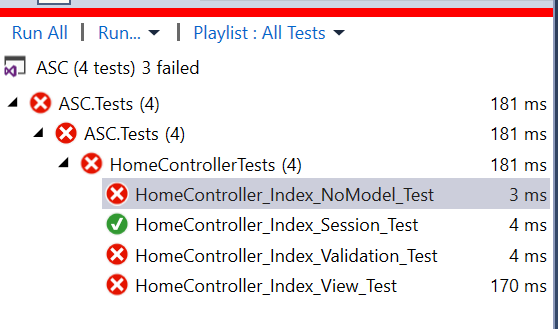

- __Quy trình phát triển ứng dụng gồm 5 bước:__

__Bước 1\.__ *Hoàn thành phân tích chức năng của view hoặc component\.*

__Bước 2\.__ *Viết *__*functional test\-case documents*__* phác thảo tất cả các tình huống \(scenarios\) phải được thử nghiệm* như một phần của quá trình đăng ký hoàn thành chức năng\.

__Bước 3\.__ *Viết các trường hợp thử nghiệm xUnit*\.

__Bước 4\.__ Phát triển mã ứng dụng và thực hiện theo quy trình lặp đi lặp lại như được đề xuất trong phần “Test\-Driven Development Life Cycle”\.

__Bước 5\.__ Sau khi hoàn thành phát triển view hoặc component, thực hiện đánh giá tài liệu trường hợp thử nghiệm chức năng cùng với các trường hợp thử nghiệm xUnit và ký tên vào báo cáo\.

__Phần 3\. Setting Up Session\-State Middleware and Its Unit\-Testing Fake__

__Session state là API phổ biến nhất__ được sử dụng bởi hầu hết các ứng dụng web ngày nay __để lưu giữ và truy xuất thông tin người dùng cụ thể__, *phổ biến cho nhiều trang và được chia sẻ giữa các yêu cầu khác nhau*\. 

Trong ASP\.NET, quản lý session bằng cách sử dụng __HttpSessionState__\. Nhưng trong ASP\.NET Core MVC, bao gồm và cấu hình  ISession middleware vào request\-response pipeline*\. *__*ISession*__* là một API mới để hỗ trợ lưu và truy xuất các đối tượng từ *__*session state*__*\. *

- Cài đặt gói __Microsoft\.AspNetCore\.Session__ NuGet trên  ASC\.Web project\.

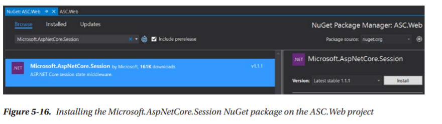

- __Cập nhật class Startup\.cs trong ASC\.Web project__

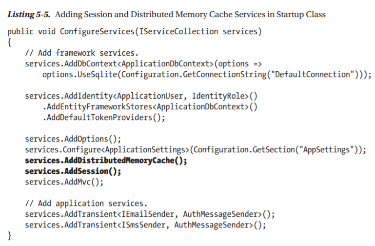

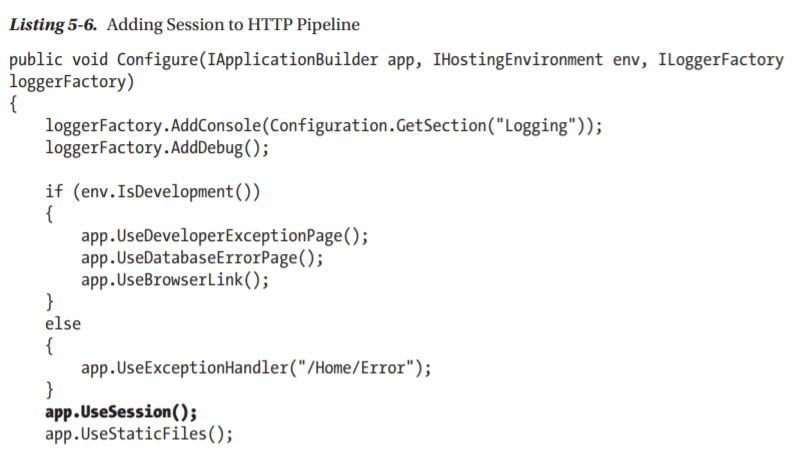

- Tạo class __SessionExtensions\.cs__ trong __ASC\.Utilities__ project

Thêm __Microsoft\.AspNetCore\.Session__ NuGet package to the __ASC\.Utilities__ project để sử dụng ISession API

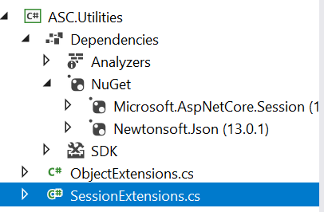

Cập nhật class __SessionExtensions\.cs__

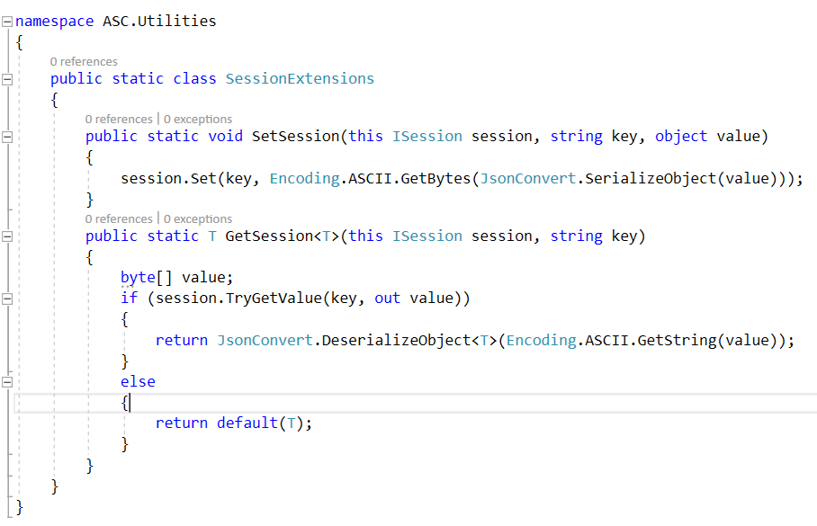

- Sử dụng __Session__ trong __Index Action__ của __HomeController__

__Adding the ASC\.Utilities project reference to the ASC\.Web project__

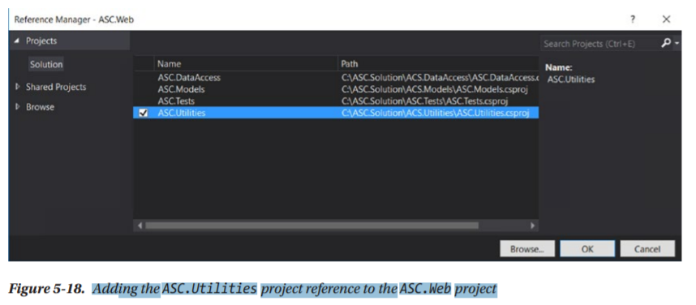

__Cập nhật Index Action của HomeController__

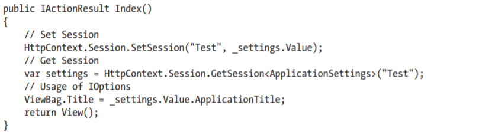

- Run all test\-case tất cả điều fail do session dependency  

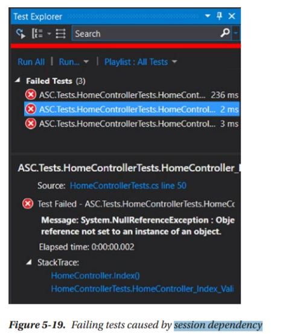

Do ASC\.Test không phải là project web nên HttpContext là null và session không tồn tài\. Nên tất cả test case của HomeControllerTests điều fail

- Để giải quyết vấn đề này, chúng ta sẽ tạo một triển khai ISession giả mạo \(fake\) trong ASC\.Test project và gán nó cho một HttpContext giả \(fake\)\.

__Tạo class FakeSession\.cs trong ASC\.Test và kế thừa Isession__

__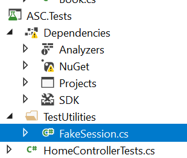__

__Adding a ASC\.Utilities project reference to the ASC\.Tests project__

__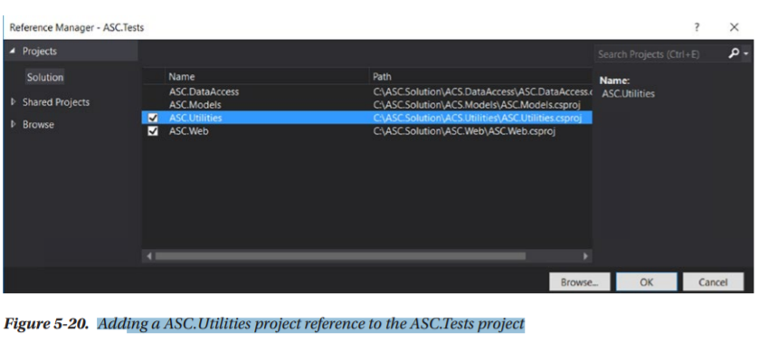__

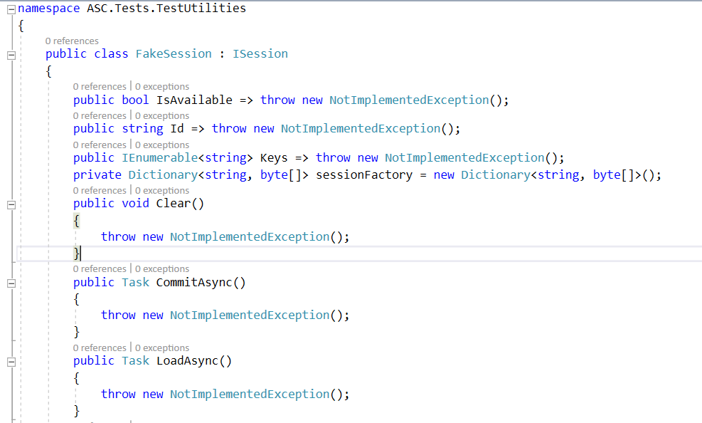

// Override __set__ and TryGetValue

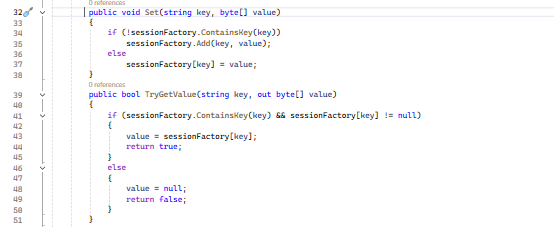

- Cập nhật HomeControllerTests\.cs trong ASC\.Test

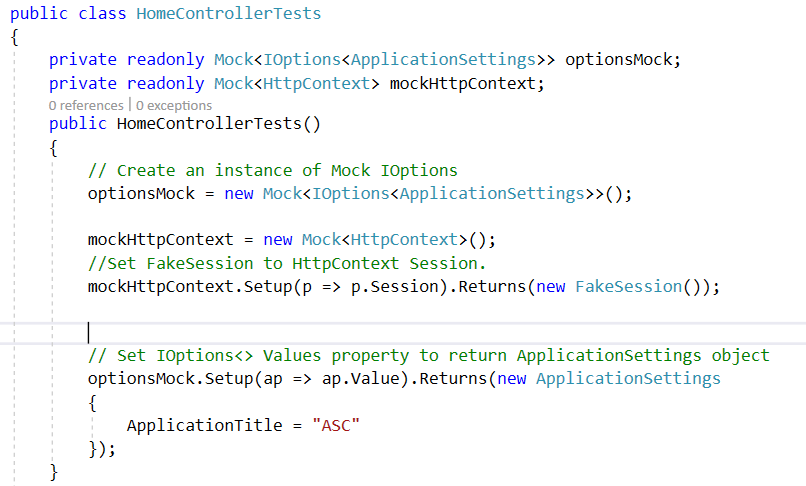

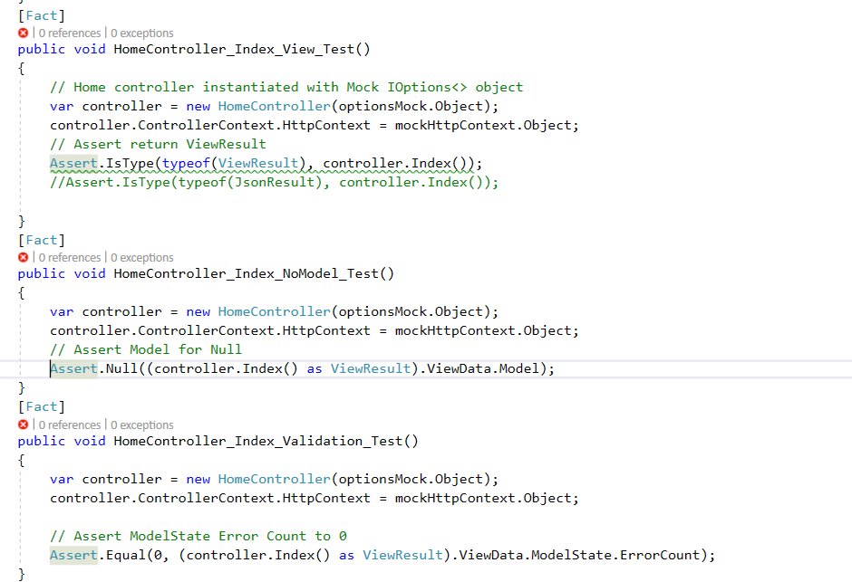

Cập nhật unit test

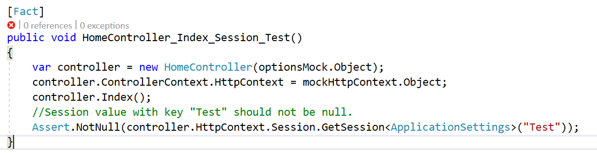

Để pass unitest này => Cập nhật Index của HomController

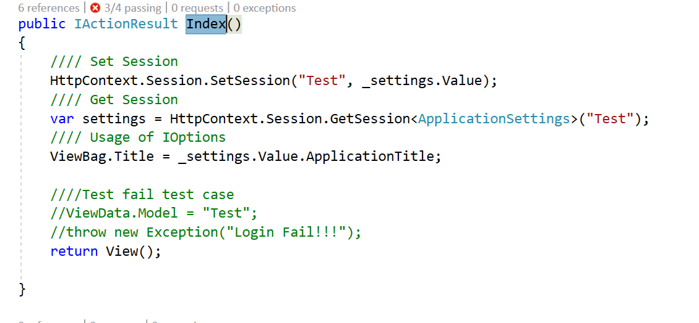

- Run all test

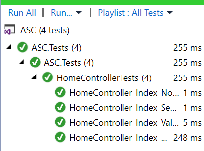

